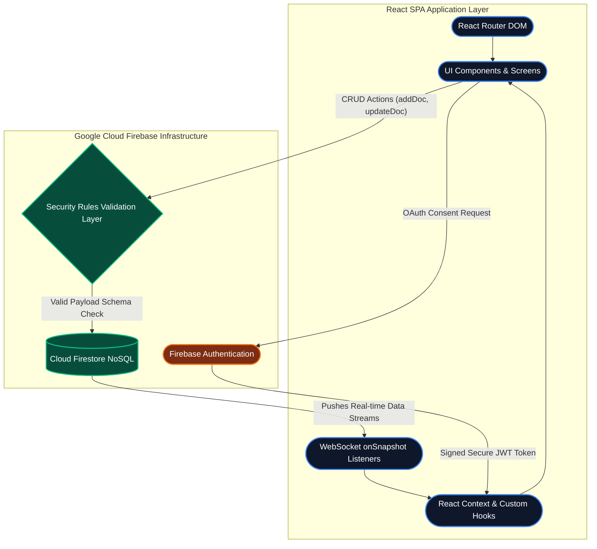
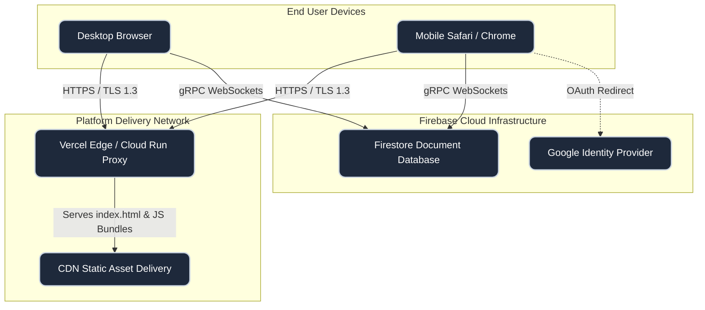
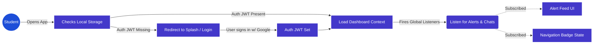
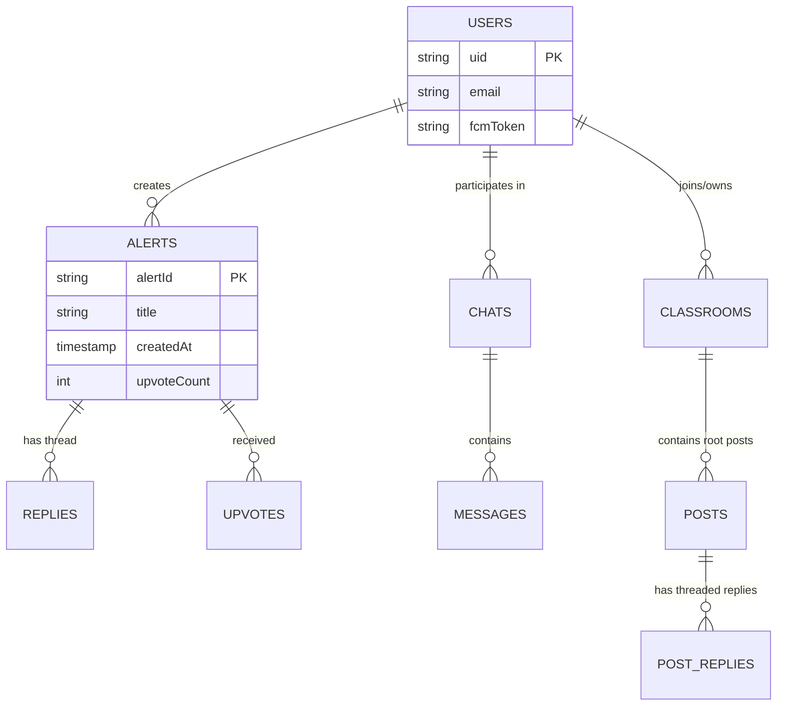
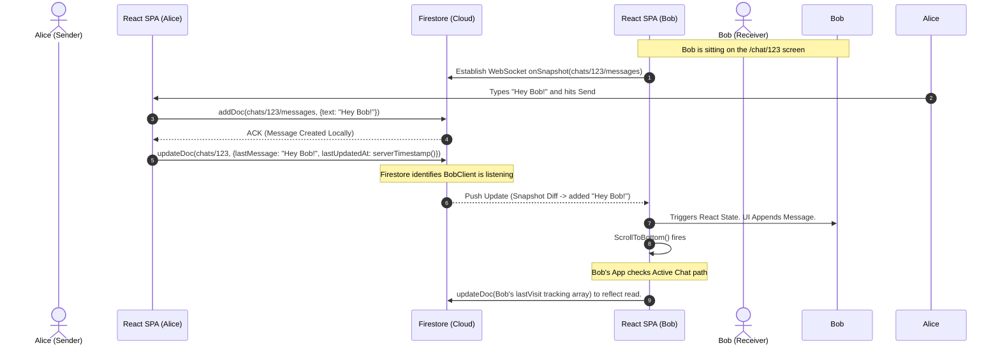
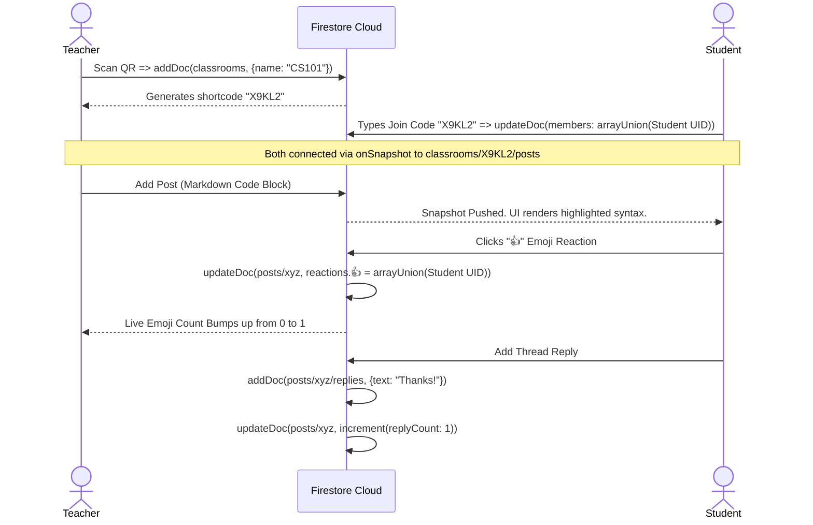
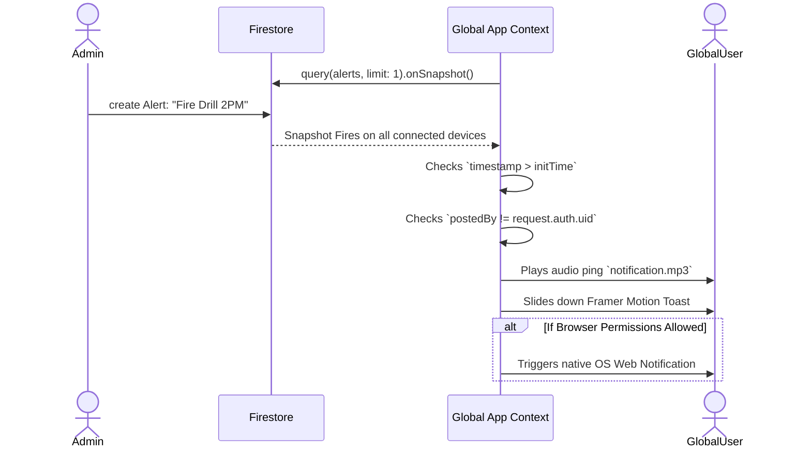

# Campus Connect & Alert System 🎓🚀


Welcome to the comprehensive, production-grade documentation for the **Campus Connect & Alert System**. This is a highly scalable, real-time, zero-latency web application meticulously designed for university and college campuses to facilitate seamless communication, instant broadcast alerts, and collaborative digital classrooms.

This document serves as the absolute "Source of Truth" for the architecture, deployment, data models, workflows, and visual design of the application. It is designed for developers, system architects, and open-source contributors looking to understand every intricate detail of the system.

---

## 📌 Table of Contents

1. [Project Overview](#1-project-overview)
2. [Target Audience & Problem Statement](#2-target-audience--problem-statement)
3. [Deep-Dive Core Features](#3-deep-dive-core-features)
4. [Technology Stack](#4-technology-stack)
5. [Architecture Visualizations](#5-architecture-visualizations)
   - [5.1 High-Level Architecture](#51-high-level-architecture)
   - [5.2 Network & Deployment View](#52-network--deployment-view)
   - [5.3 Information Flow Diagram](#53-information-flow-diagram)
6. [Database Architecture (Firestore Enterprise)](#6-database-architecture-firestore-enterprise)
   - [6.1 Collections & ERD (Entity Relationship Diagram)](#61-collections--erd-entity-relationship-diagram)
   - [6.2 Schema Documentation (TypeScript Mappings)](#62-schema-documentation-typescript-mappings)
   - [6.3 Security Rules & ABAC Constraints](#63-security-rules--abac-constraints)
7. [System Workflows & Sequence Diagrams](#7-system-workflows--sequence-diagrams)
   - [7.1 Real-time Chat Delivery Flow](#71-real-time-chat-delivery-flow)
   - [7.2 Classroom Post & Nested Thread Flow](#72-classroom-post--nested-thread-flow)
   - [7.3 Alert Broadcasting & Notifications Flow](#73-alert-broadcasting--notifications-flow)
8. [Frontend Internal Architecture](#8-frontend-internal-architecture)
   - [8.1 File Structure](#81-file-structure)
   - [8.2 State Management & Performance Handling](#82-state-management--performance-handling)
9. [UI/UX Philosophy & Design System](#9-uiux-philosophy--design-system)
10. [Setup & Local Installation Guide](#10-setup--local-installation-guide)
11. [Deployment Strategy](#11-deployment-strategy)
12. [Future Roadmap & Scaling Strategies](#12-future-roadmap--scaling-strategies)

---

## 1. Project Overview

Campus Connect is a real-time SPA (Single Page Application) acting as a central hub for student and faculty interaction. It completely replaces fragmented WhatsApp groups, static email blasts, and outdated university portal boards with a localized, fast, modern alternative.

The application operates fundamentally on real-time asynchronous data streams via **Firebase**, utilizing **React** for a highly responsive, app-like frontend interface wrapped in **Vite** for rapid tooling and compilation.

### Key Goals

- Eradicate latency in student-faculty communication.
- Create a unified space for campus announcements (Emergency, Social, Academic).
- Provide digital sandbox spaces (Classrooms) for localized group collaboration.

---

## 2. Target Audience & Problem Statement

### The Problem

Universities suffer from fragmented communication. Emergency alerts are sent via archaic SMS systems that students ignore. Class communication happens on secondary unmoderated networks. There is no single "campus digital twin."

### The Solution

A unified, real-time platform where:

1. Admins/Students can trigger categorized global alerts.
2. Students can create study spaces, scan QR codes to enter a hall, and immediately chat.
3. Users receive instantaneous, WebSocket-powered popups for critical alerts seamlessly on any device.

---

## 3. Deep-Dive Core Features

### 🚨 Real-time Campus Alerts

- **Broadcast System:** Post campus-wide alerts seamlessly.
- **Categorization Engine:** Alerts are structured with specific tags (`🚨 Emergency`, `📅 Event`, `📢 Notice`, `🔍 Lost & Found`, `❓ Question`).
- **Pulsing Notifications:** Utilizes `<AnimatePresence>` from Framer Motion for non-blocking UI popups. Users receive real-time, system-level audio pings and browser alerts.
- **Engagement Mechanism:** Prevents spam through an immutable upvote checking system. Features deeply nested reply threads for contextual discussions.

### 📚 Digital Classrooms / Spaces

- **Instant Enrollment:** Users join via a mathematically generated 6-character shortcode or by dynamically rendering and scanning a `QRCodeSVG`.
- **Markdown & Code Support:** Posts natively render markdown (`react-markdown`). Developers sharing homework can paste code snippets perfectly formatted.
- **Micro-Polling System:** Posts can embed live-updating polls. Clicking an option dynamically recalculates percentages using an optimistic UI.
- **Emoji Reactions Board:** Users can applaud, laugh, or question a post with emojis. Data is strictly managed under a unique ABAC Map structure in Firestore.

### 💬 Asynchronous Direct Messaging & Inbox

- **Sub-millisecond Latency:** Built strictly using Firebase `onSnapshot()`, completely bypassing typical REST latency. Send a message, and the recipient's UI updates synchronously within milliseconds.
- **Intelligent Read-Receipts:** System uses a `lastVisit` differential timestamp system. If a chat updates _after_ your last visit, it paints an unread glowing badge universally across the Navbar.
- **Fluid Keyboard Architecture:** Safe constraints prevent the layout from breaking when mobile virtual keyboards pop up, heavily relying on `env(safe-area-inset-bottom)`.

### ⚙️ Identity & Device Customization

- **Profile Customization:** Instantly change avatars, display names, and identity markers.
- **Push Notification Governance:** Complete control over browser permission checks.

---

## 4. Technology Stack

### Core Client

| Technology              | Description                                         |
| ----------------------- | --------------------------------------------------- |
| **React 18**            | Rendering Engine                                    |
| **Vite**                | Blazing fast build tool                             |
| **TypeScript (Strict)** | Static typing for enterprise-grade defect reduction |
| **React Router v6**     | Client-side routing with nested layout engines      |

### UI / UX / Styling

| Technology             | Description                                                  |
| ---------------------- | ------------------------------------------------------------ |
| **Tailwind CSS 3.x**   | Utility-first CSS for atomic, mobile-forward development     |
| **Motion (Framer)**    | Spring-physics based animation library for fluid transitions |
| **Lucide React**       | Scalable, accessible SVG icon assets                         |
| **Emoji-Picker-React** | Performant local emoji picker mapped to the OS layout        |
| **react-markdown**     | Safe, sanitized markdown rendering engine                    |

### Backend & Cloud Infrastructure (Firebase Enterprise)

| Technology                   | Description                                                               |
| ---------------------------- | ------------------------------------------------------------------------- |
| **Cloud Firestore**          | NoSQL, horizontally scalable document database mapped across global edges |
| **Firebase Auth**            | Stateless JWT Authentication handling Google OAuth                        |
| **Firestore Security Rules** | Zero-trust validation layer protecting ABAC structures                    |

---

## 5. Architecture Visualizations

### 5.1 High-Level Architecture

_The following diagram shows the logical bounds between the client application and the distributed cloud persistence._



### 5.2 Network & Deployment View

_Visualizes the physical mapping of where compute happens versus where persistence is managed._



### 5.3 Information Flow Diagram



---

## 6. Database Architecture (Firestore Enterprise)

The system avoids relational database table locking models and embraces heavily denormalized, horizontally scalable NoSQL graphs. Read operations are cheap (O(1)) and write operations are strictly audited.

### 6.1 Collections & ERD (Entity Relationship Diagram)



### 6.2 Schema Documentation (TypeScript Mappings)

To enforce strictness across the NoSQL void, here are the core TypeScript schemas mapping directly to our Firestore documents:

#### `User` Schema

```typescript
interface UserProfile {
  uid: string;
  email: string;
  displayName: string;
  photoURL: string;
  fcmToken: string | null;
  showActivity: boolean; // Controls public visibility
  publicProfile: boolean; // Controls searchability
  createdAt: Timestamp;
}
```

#### `Alert` Schema

```typescript
interface Alert {
  id: string; // Document ID
  title: string;
  body: string;
  category:
    | "🚨 Emergency"
    | "📅 Event"
    | "📢 Notice"
    | "🔍 Lost & Found"
    | "❓ Question";
  postedBy: string; // Foreign Key: User Uid
  postedByName: string; // Denormalized for fast O(1) rendering
  timestamp: Timestamp;
  upvotes: number;
  replyCount: number;
}
```

#### `Classroom Post` Schema

```typescript
interface ClassroomPost {
  id: string;
  authorId: string;
  authorName: string;
  authorPhoto: string;
  text: string; // Markdown supported
  createdAt: Timestamp;
  replyCount: number;
  reactions: Record<string, string[]>; // e.g. { "👍": ["uid1", "uid2"], "🚀": ["uid3"] }
  poll?: {
    question: string;
    options: { text: string; votes: string[] }[]; // votes array contains User UIDs
  };
}
```

### 6.3 Security Rules & ABAC Constraints

The database is fortified by a robust set of Firebase Security Rules. It treats the client as a fundamentally compromised execution environment.

**Core Rules Built In:**

1. **Ownership Lock:** You can only modify your own user profile (`request.auth.uid == userId`).
2. **Schema Integrity:** A post can only be created if it has the required fields. `affectedKeys().hasOnly(['fieldA', 'fieldB'])` is used aggressively on updates to prevent arbitrary data insertion.
3. **Chat Room Privacy:** A user can _only_ read a chat room if their exact UID exists within the `participants` array stored on the document structure. No wildcards. No exceptions.

---

## 7. System Workflows & Sequence Diagrams

Because the system is deeply asynchronous, standard REST workflows do not apply. Data is synchronized via real-time WebSocket diffing arrays.

### 7.1 Real-time Chat Delivery Flow

This diagram demonstrates how Alice's message hits Bob's screen within 20 milliseconds without Bob ever pulling or polling for data.



### 7.2 Classroom Post & Nested Thread Flow

How multiple people interact in a shared dynamic digital room.



### 7.3 Alert Broadcasting & Notifications Flow



---

## 8. Frontend Internal Architecture

The application is meticulously layered to prevent prop-drilling, isolate side effects, and optimize re-rendering.

### 8.1 File Structure

```text
campus-connect/
├── public/                 # Static Assets (Logos, notification audio)
├── src/                    # Primary Source Directory
│   ├── components/         # Independent / Reusable UI Atoms
│   │   ├── AlertCard.tsx   # Core component for mapping alerts
│   │   ├── ...
│   ├── constants/          # Static configuration files
│   │   └── categories.ts   # Enum mapping for system tag taxonomy
│   ├── contexts/           # Global React Contexts Providers (Auth)
│   │   └── AuthContext.tsx # Centralizes Firebase User fetching & caching
│   ├── layouts/            # Persistent Structural wrappers
│   │   └── MainLayout.tsx  # Wraps children in the Cyber-Gradient Background + Nav
│   ├── lib/                # Utility pure functions
│   │   └── utils.ts        # Contains `cn()` (clsx + tailwind-merge equivalent)
│   ├── screens/            # Macro-Level Page Views
│   │   ├── AlertDetail.tsx
│   │   ├── Board.tsx
│   │   ├── ChatScreen.tsx
│   │   ├── ClassroomDetail.tsx
│   │   ├── Classrooms.tsx
│   │   ├── Inbox.tsx
│   │   ├── Settings.tsx
│   │   └── Splash.tsx
│   ├── App.tsx             # The orchestrator. Defines routing & global listeners
│   ├── firebase.ts         # Firebase App configuration & SDK instantiation
│   ├── index.css           # Global Tailwind CSS Imports & CSS Variables
│   └── main.tsx            # React DOM Bootstrapper
├── .eslintrc.json          # Linter Configuration
├── package.json            # Deployment deps
├── tsconfig.json           # Strict TS configuration rules
└── vite.config.ts          # Compilation tool chain
```

### 8.2 State Management & Performance Handling

Because `onSnapshot` queries run infinitely until unmounted, the application strictly governs their lifecycle via `useEffect` cleanup arrays.

**Debouncing User Input:** Re-renders on intense inputs (like Chat composition or Reply formulation) are confined entirely to local component state `[text, setText]`. The database is _never_ hit per-keystroke. Form submission halts propagation and relies on an optimistic UI strategy or strict disabled toggles `disabled={loading}` until the server responds.

**Timestamp Logic Filtering:** When you load the app, your connection opens a listener. To avoid firing 100 historical notification sounds, `App.tsx` caches `initTimeRef.current = Date.now()`. The listener then explicitly checks if `snapshot.added.timestamp > initTimeRef.current` before triggering an audible alert.

---

## 9. UI/UX Philosophy & Design System

The application deliberately rejects dry, sterile "Academic Portal" aesthetics. It instead adopts a highly modern, immersive **Dev-Night-Owl Aesthetic**.

### 9.1 Color Palette

- **Background Root:** `#0B0F19` (Deep, abyssal dark mode base).
- **Surface Cards:** `#1A1D2D` with subtle `rgba(255,255,255,0.05)` borders for depth tracking.
- **Accents:**
  - Brand Purple: `#7C3AED` (Main calls to action, gradients, highlight borders)
  - Bright Cyan: `#06B6D4` (Secondary gradients, success states)
  - Emergency Red: `#EF4444` (Critical destructive actions, Emergency alert tags)

### 9.2 Typography & Spacing

- **Primary Font:** `Inter` - Used for heavy legibility.
- **Micro-copy & Code:** `JetBrains Mono` - Used for metadata, dates, and markdown code injections to instill a raw mathematical truth.
- **Spacing:** Elements adhere strictly to a dense 4px foundational grid (`p-2`, `gap-4`).

### 9.3 Motion & Interactivity

- Hover states employ scale modifiers (`hover:scale-[1.02]`) and soft transition glow properties.
- Contextual menus trigger on AnimatePresence mount cycles, providing smooth spatial awareness rather than jerky immediate renders.

---

## 10. Setup & Local Installation Guide

Assuming you have `Node` and `Git` installed natively on your environment.

### 10.1 Clone and Prepare

```bash
# 1. Clone the repository
git clone https://github.com/your-username/campus-connect.git
cd campus-connect

# 2. Guarantee proper dependency installation
npm install --legacy-peer-deps
```

### 10.2 Firebase Credentials Setup

The application is pre-configured to look for a `firebase-applet-config.json` inside the `src/` directory. Create it.

```json
{
  "apiKey": "AIzaSyYourSecretKeyGOESHere",
  "authDomain": "your-project-id.firebaseapp.com",
  "projectId": "your-project-id",
  "storageBucket": "your-project-id.appspot.com",
  "messagingSenderId": "00000000",
  "appId": "1:00000:web:000000",
  "firestoreDatabaseId": "(default)"
}
```

### 10.3 Run Dev Server

```bash
npm run dev
# Vite will rapidly compile and expose an endpoint, usually http://localhost:3000
```

---

## 11. Deployment Strategy

### Option A: Vercel / Netlify Edge (Recommended for Frontend)

1. Commit all files to a mapped Git Repository.
2. Link your Vercel/Netlify account.
3. Keep default settings (`npm run build`, output dir: `dist`).
4. Ensure you set "Rewrite all requests to `/index.html`" on your hosting provider to safely handle React Router DOM client side navigation.

### Option B: AI Studio / Google Cloud Run (Containerized)

This app is natively built to run under a Google Cloud Run Docker image via `vite build`.

```bash
# Production optimization checklist:
# - Ensure NO console.logs containing PII.
# - Ensure firestore.rules are formally deployed via CLI:
#   firebase deploy --only firestore:rules
npm run build
```

---

## 12. Future Roadmap & Scaling Strategies

The NoSQL foundation allows the app to easily scale to tens of thousands of concurrent users per campus. Future iterations will focus on:

1. **Rich Media File Storage:** Incorporating Firebase Cloud Storage buckets to allow students to upload directly into Classroom posts (Images, zip files, PDFs).
2. **Offline Mode:** Integrating Firestore's `enableIndexedDbPersistence()` to allow users to scroll alerts while moving through cellular dead zones (e.g., campus basements).
3. **Role-Based Moderation System:** Enabling structural "Deans" or "Moderator" Firebase Security Rule roles that grant super-user power to delete spam globally, explicitly overriding the `isOwner()` constraint mappings.
4. **End-to-End Chat Encryption:** Utilizing native Web-Crypto API to generate public-private key pairs stored in the user profile to obfuscate 1-on-1 DB layer read-visibility.

---

_End of Protocol Documentation._
_System verified and architecture solidified for scale._ 🚀
