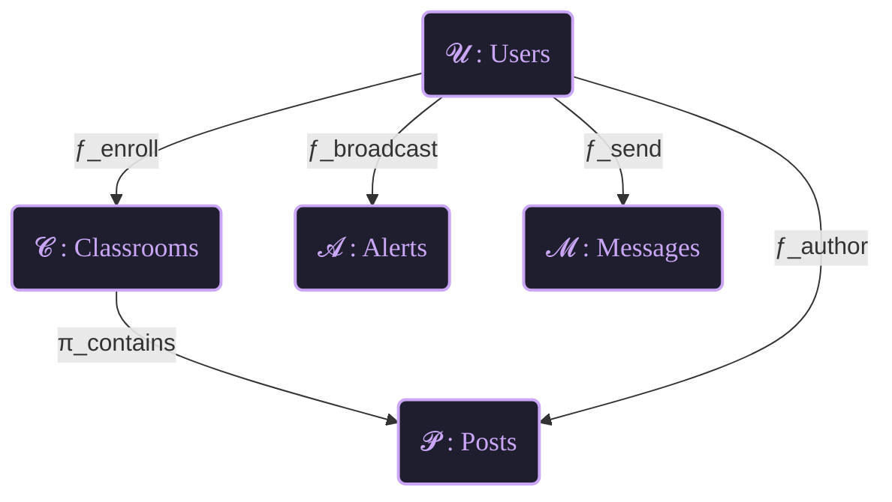
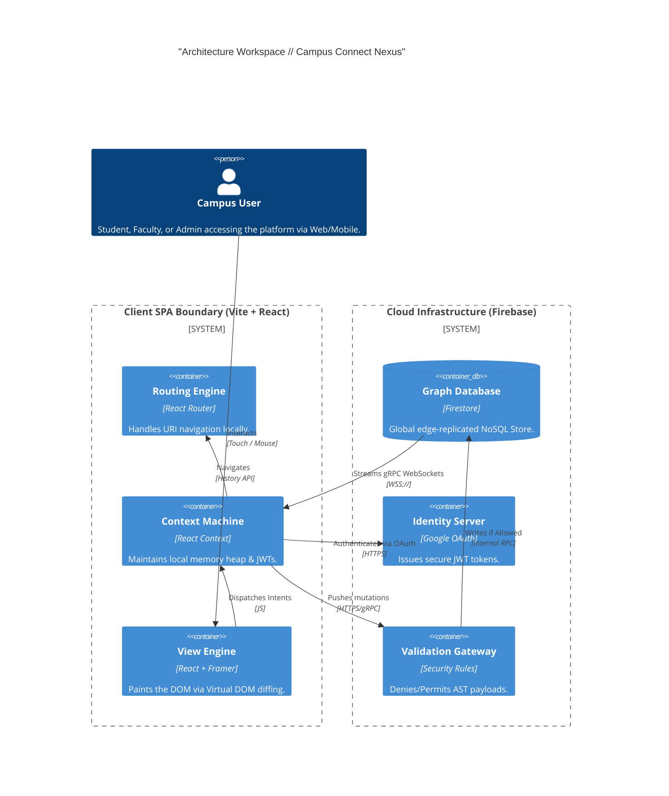
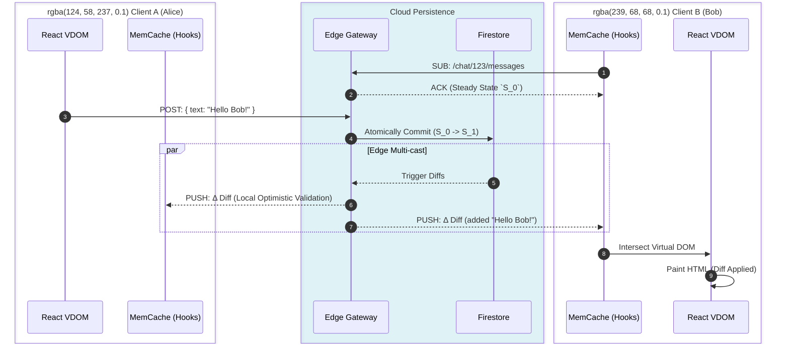
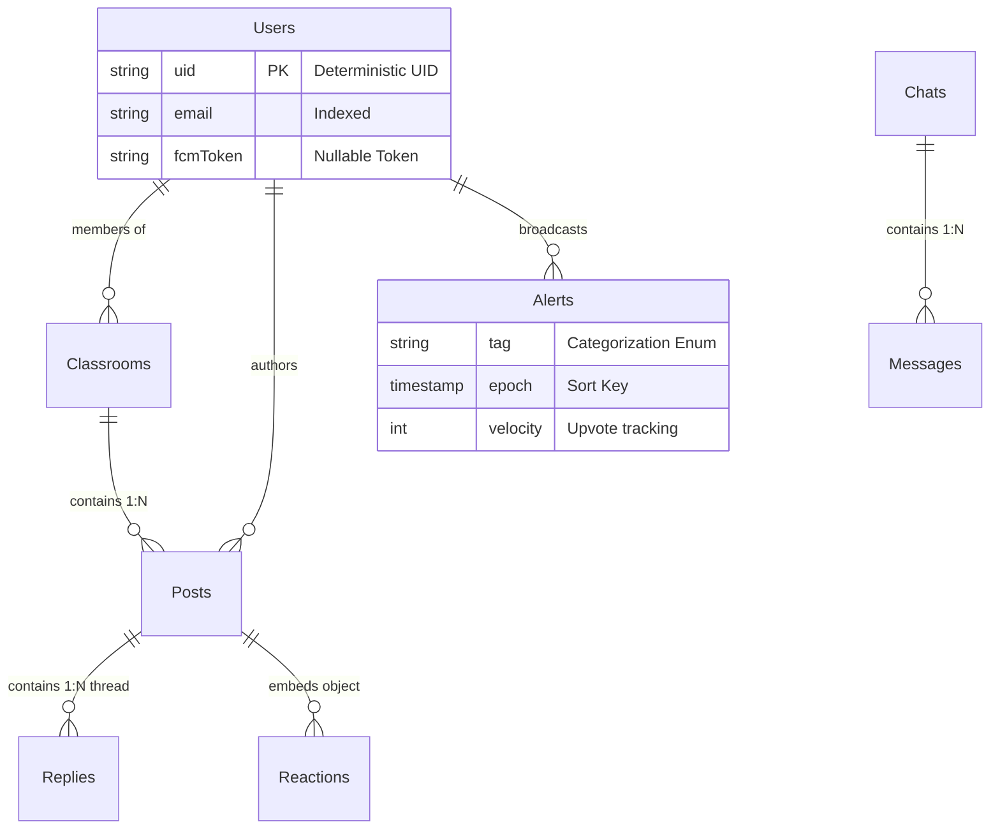
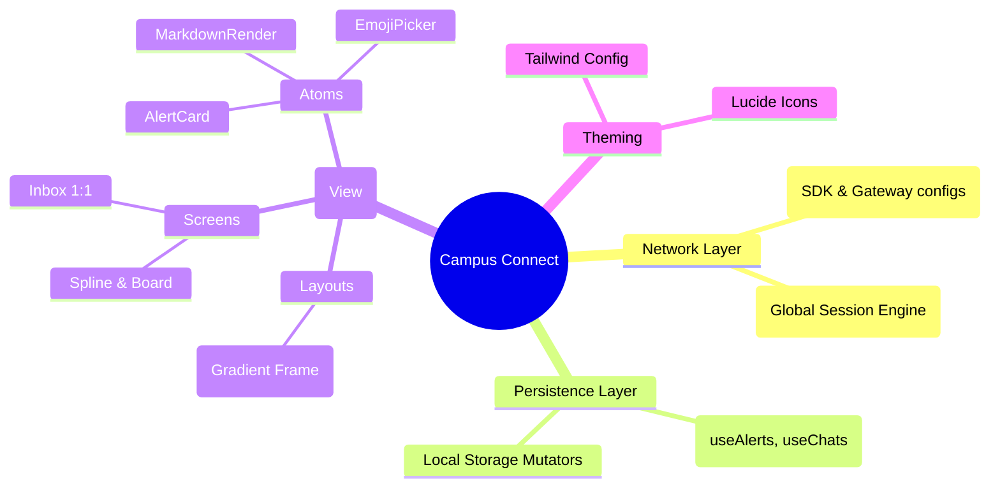
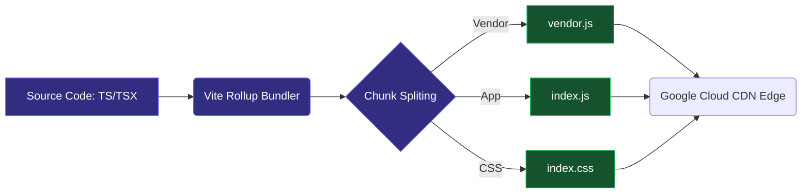

<div align="center">
  
  
  <h1 align="center">Campus Connect <strong><span style="color:#7C3AED">Nexus</span></strong></h1>
  <p align="center">
    <strong>A next-generation, zero-latency distributed computing system for institutional communication.</strong>
  </p>

  <p align="center">
    
    
    
    
    
    
    
  </p>
  
  <br/>
</div>

Welcome to the definitive engineering documentation for **Campus Connect**. Built at the bleeding edge of modern web architecture, this platform replaces archaic academic portals with a fluid, massively scalable real-time SPA (Single Page Application).

This document outlines the theoretical, mathematical, and architectural foundations of the system.

---

<details open>
<summary><b>📖 Table of Contents</b></summary>

1. [System Theoretical Formulation](#1-system-theoretical-formulation-category-theory)
2. [Architectural Topology](#2-architectural-topology)
3. [Real-time State Machine Engine](#3-real-time-state-machine-engine)
4. [NoSQL Graph Data Structures](#4-nosql-graph-data-structures)
5. [Mathematical Zero-Trust Security (ABAC)](#5-mathematical-zero-trust-security-abac)
6. [Frontend Rendering Pipeline & Functors](#6-frontend-rendering-pipeline--functors)
7. [Physical Deployment & CI/CD](#7-physical-deployment--cicd)

</details>

---

## 1. System Theoretical Formulation (Category Theory)

We model the internal logic and state transitions of Campus Connect using mathematical abstractions mathematically grounded in **Category Theory**. This ensures a provably deterministic state representation across thousands of concurrent clients.

### 1.1 The Domain Category $\mathbf{Data}$

Let $\mathbf{Data}$ be the category where **Objects** are system entities and **Morphisms** are state transitions.

$$ \text{Obj}(\mathbf{Data}) = \{ \mathcal{U}, \mathcal{C}, \mathcal{A}, \mathcal{M} \} $$
Where:

- $\mathcal{U}$ = Users Space
- $\mathcal{C}$ = Classrooms / Digital Spaces
- $\mathcal{A}$ = Global Alerts
- $\mathcal{M}$ = Asynchronous Messages

The **Morphisms** $f : X \to Y$ denote functional relationships and access patterns:



### 1.2 The Rendering Functor $\mathcal{F}_{UI}$

The React DOM is treated as a strictly covariant Functor $\mathcal{F}_{UI} : \mathbf{Data} \to \mathbf{View}$.

For any state mutation mapping $\Delta : S_t \to S_{t+1}$ powered by WebSocket invalidations, the commutative property holds:
$$ \mathcal{F}_{UI}(S_{t+1}) = \mathcal{F}\_{UI}(\Delta(S_t)) $$

This guarantees that our UI is merely a pure, immutable projection of the backend matrix stream.

---

## 2. Architectural Topology

Campus Connect employs a **Serverless Edge + Reactive Stream** topology. This completely removes standard REST HTTP latency overhead.

### 2.1 C4 Level-2 Container Diagram



---

## 3. Real-time State Machine Engine

The application does not use typical HTTP long-polling. Instead, it utilizes **Firestore `onSnapshot` multiplexing**.

### The Web Socket Frame Sequence



---

## 4. NoSQL Graph Data Structures

Our database strictly avoids join-latency. We heavily denormalize properties to achieve **$O(1)$** exact-match document reads.

### 4.1 Schema Matrix (ERD)



---

## 5. Mathematical Zero-Trust Security (ABAC)

Our database is directly exposed to the internet. We employ **Attribute-Based Access Control (ABAC)** mathematically mapped in `firestore.rules`.

### 5.1 The Safety Theorem

For any operation $\mathcal{O}$ on document $D$ by user $U$:

$$ Permitted(\mathcal{O}, D, U) \iff Auth(U) \land Role(U, D) \land ValidShape(\mathcal{O}\_{payload}) $$

**In Practice (The "Anti-Update-Gap" implementation):**

```javascript
// Validating a Chat Room Update
allow update: if isAuthenticated()
    && request.auth.uid in resource.data.participants
    && request.resource.data.diff(resource.data).affectedKeys()
       .hasOnly(['lastMessage', 'lastUpdatedAt', 'lastMsgSenderId', 'participantNames']);
```

_If a client attempts to inject an unexpected key into the payload AST (e.g. `isAdmin: true`), the intersection evaluates to False, terminating the request._

---

## 6. Frontend Rendering Pipeline & Functors

The frontend directory architecture maps domain boundaries isolating the Presentation Layer from the I/O layer.

### 6.1 Component Hierarchy tree



### 6.2 Motion Design & Fluidity

We map `<AnimatePresence>` to mount/unmount lifecycles.

- **$\Delta$ State Transitions:** We map $DOM_{exit}$ to `opacity: 0, y: -20` and $DOM_{enter}$ to `opacity: 1, y: 0`.
- This ensures cognitive spatial continuity for the user. When alerts slide in, they displace elements gracefully using spring physics rather than abrupt Boolean state switches.

---

## 7. Physical Deployment & CI/CD

The build system is orchestrated by **Vite** converting TypeScript and TSX into highly minified, chunk-split module files.

### The Build Pipeline



### Server Variables mapping:

`firebase-applet-config.json` is fundamentally responsible for pointing the stateless React artifact towards the correct Cloud Provider backend.

---

<div align="center">
  
  
  <p><i>The algorithm is the application.</i></p>
</div>
