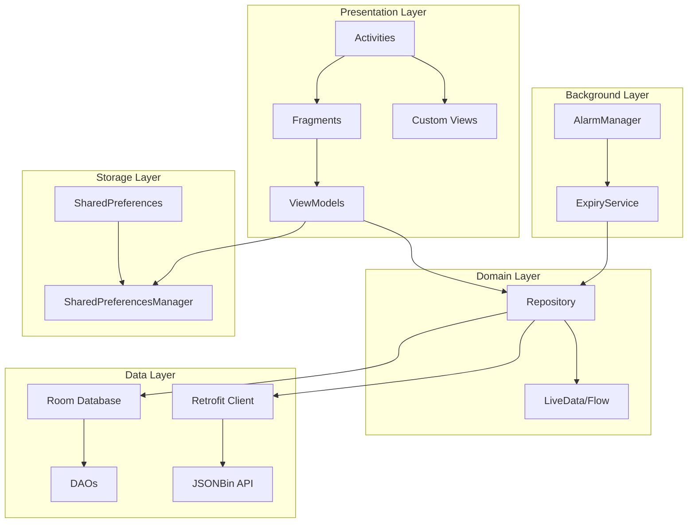
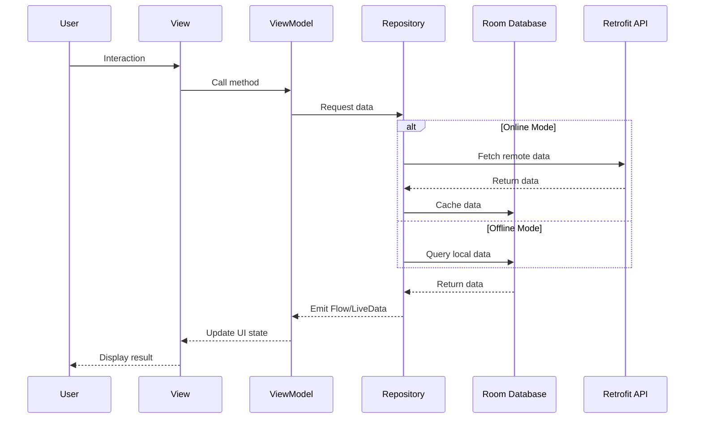
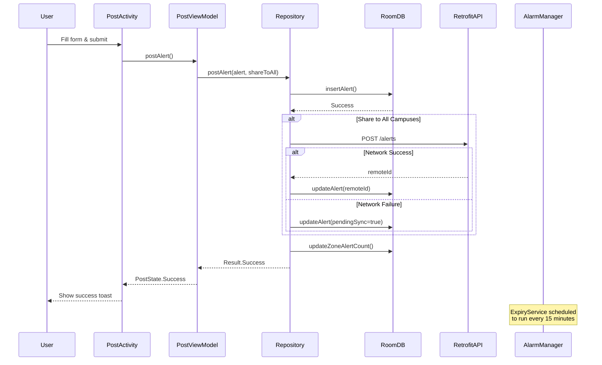
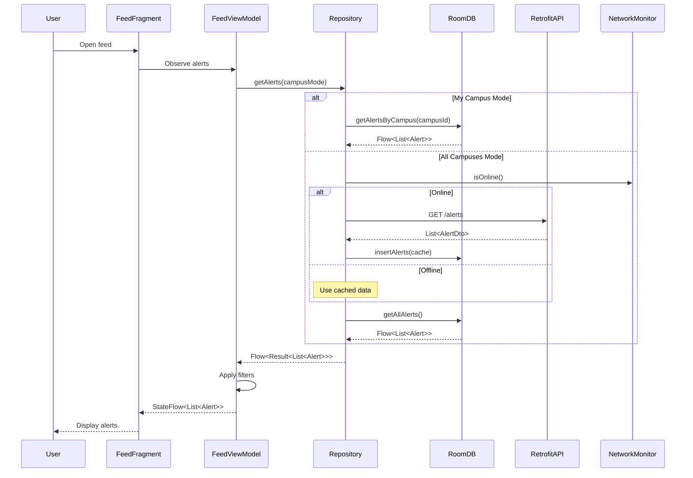
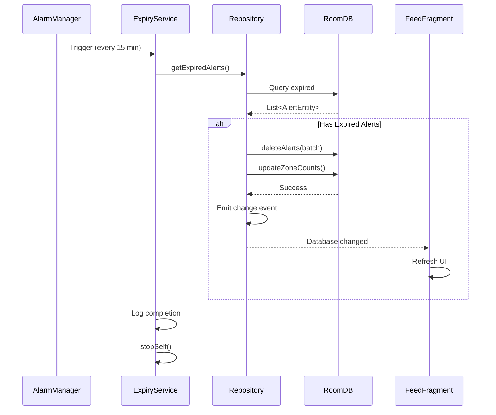
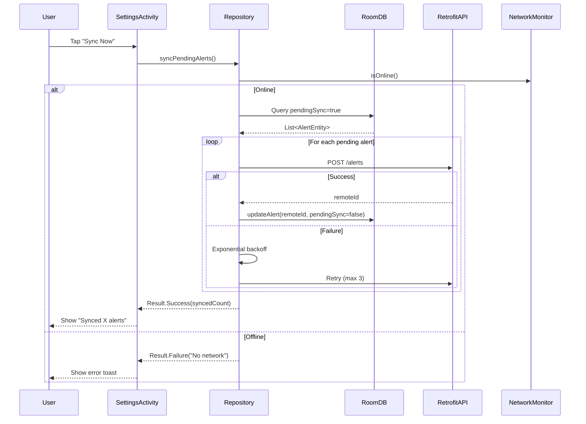

# Requirements Document: CampusAlert Android Application

## Introduction

CampusAlert is a hyperlocal anonymous notice board Android application designed for college students to post and view short-lived alerts about campus events, hazards, lost items, and academic updates. The application supports multi-campus visibility with local and remote data synchronization, zone-based alert density visualization, and automatic alert expiry management. The system demonstrates comprehensive Android development patterns including MVVM architecture, Room database, Retrofit networking, background services, and custom UI components covering the complete VTU MAD lab syllabus.

## Glossary

- **Alert**: A time-bound notification posted by a user containing title, body, category, severity, zone, and expiry information
- **Alert_Repository**: The data layer component that provides a single source of truth for alerts, managing both local Room database and remote Retrofit API calls
- **Alert_Entity**: The Room database entity representing an alert with fields: id, title, body, category, severity, zone, deviceId, postedAt, expiresAt, isResolved, campusId
- **Campus_Zone**: A geographical subdivision of a campus (e.g., Library, Cafeteria, Parking) with associated location coordinates
- **Campus_Zone_Entity**: The Room database entity representing a campus zone with fields: zoneId, zoneName, latitude, longitude, activeAlertCount
- **Device_ID**: A unique identifier generated and stored in SharedPreferences to enable anonymous posting while tracking user's own alerts
- **Expiry_Service**: A background Android Service triggered by AlarmManager that removes expired alerts from the database
- **Feed_View**: The main screen displaying alerts filtered by campus scope (My Campus or All Campuses)
- **Heatmap_View**: A custom Canvas-based visualization showing alert density across campus zones using color interpolation
- **JSONBin_API**: The remote REST API endpoint (JSONBin.io) used for synchronizing alerts across all campuses
- **My_Campus_Mode**: Display mode showing only alerts from the user's home campus stored in local Room database
- **All_Campuses_Mode**: Display mode showing alerts from all campuses fetched via Retrofit from JSONBin API
- **Report_Entity**: The Room database entity for tracking alert reports with fields: reportId, alertId, reason, reportedAt
- **Severity_Level**: An enumeration of alert urgency (Low, Medium, High, Critical)
- **Alert_Category**: An enumeration of alert types (Lost_And_Found, Event, Hazard, Academic)
- **Shared_Preferences_Manager**: Component managing persistent key-value storage for deviceId, username, home campus, and user preferences
- **Zone_Heatmap_View**: Custom Android View extending Canvas that renders campus zones as rectangles with heat colors based on alert density
- **Alarm_Manager**: Android system service that triggers the Expiry_Service at 15-minute intervals
- **View_Model**: MVVM architecture component (FeedViewModel, MyAlertsViewModel, HeatmapViewModel, PostViewModel) managing UI state and business logic
- **Retrofit_Client**: HTTP client library used for making REST API calls to JSONBin API
- **Room_Database**: Local SQLite database abstraction layer storing AlertEntity, CampusZoneEntity, and ReportEntity

## Requirements

### Requirement 1: Alert Creation and Posting

**User Story:** As a college student, I want to post anonymous alerts with detailed information, so that I can quickly notify other students about important campus events, hazards, or lost items.

#### Acceptance Criteria

1. WHEN a user submits a valid alert form, THE Alert_Repository SHALL persist the alert to Room database with a unique id, current timestamp, and generated expiry timestamp
2. THE Alert_Repository SHALL generate a Device_ID on first app launch and store it in Shared_Preferences_Manager for anonymous identification
3. WHEN a user selects an alert category, THE Post_Alert_Activity SHALL display category-specific fields (Lost_And_Found shows item description, Event shows date picker, Hazard shows severity selector, Academic shows course field)
4. WHEN a user sets alert expiry, THE Alert_Repository SHALL calculate expiresAt timestamp as postedAt plus selected duration (1 hour, 6 hours, 24 hours, 3 days, 7 days)
5. WHERE the user enables "Share to All Campuses" toggle, THE Alert_Repository SHALL post the alert to both Room database and JSONBin_API via Retrofit_Client
6. WHEN alert posting fails due to network error, THE Post_Alert_Activity SHALL display error toast and save alert to Room database with pending sync flag
7. THE Alert_Entity SHALL contain fields: id, title (max 100 chars), body (max 500 chars), category, severity, zone, deviceId, postedAt, expiresAt, isResolved, campusId
8. WHEN a user submits an alert with empty title or body, THE Post_Alert_Activity SHALL display validation error and prevent submission
9. FOR ALL valid alerts, the alert title length SHALL be between 1 and 100 characters and body length SHALL be between 1 and 500 characters (invariant property)
10. FOR ALL posted alerts, the expiresAt timestamp SHALL be greater than postedAt timestamp (invariant property)

### Requirement 2: Alert Feed Display and Filtering

**User Story:** As a college student, I want to view alerts filtered by campus scope, so that I can see relevant notifications for my location or explore alerts from other campuses.

#### Acceptance Criteria

1. WHEN a user opens the Feed_View, THE Feed_View_Model SHALL load alerts from Alert_Repository based on current campus mode (My_Campus_Mode or All_Campuses_Mode)
2. WHILE in My_Campus_Mode, THE Alert_Repository SHALL query only alerts from Room database where campusId matches user's home campus
3. WHILE in All_Campuses_Mode, THE Alert_Repository SHALL fetch alerts from JSONBin_API via Retrofit_Client and merge with local Room database alerts
4. WHEN the user toggles campus mode, THE Feed_View_Model SHALL refresh the alert list within 2 seconds
5. THE Feed_View SHALL display alerts in RecyclerView sorted by postedAt timestamp in descending order (newest first)
6. WHEN an alert's expiresAt timestamp is within 1 hour of current time, THE Feed_View SHALL display a countdown timer showing remaining minutes
7. WHEN a user applies category filter, THE Feed_View_Model SHALL filter alerts to show only selected categories (Lost_And_Found, Event, Hazard, Academic)
8. WHEN a user applies severity filter, THE Feed_View_Model SHALL filter alerts to show only selected severity levels (Low, Medium, High, Critical)
9. WHEN the Feed_View is empty, THE Feed_View SHALL display an empty state message with illustration
10. FOR ALL alert lists, applying a filter then removing it SHALL return the original unfiltered list (idempotent property)
11. FOR ALL alert lists, the count of filtered alerts SHALL be less than or equal to the count of unfiltered alerts (metamorphic property)

### Requirement 3: Alert Detail View and Actions

**User Story:** As a college student, I want to view full alert details and perform actions like sharing or viewing location, so that I can get complete information and take appropriate action.

#### Acceptance Criteria

1. WHEN a user taps an alert in Feed_View, THE Feed_View SHALL launch Alert_Detail_Activity with explicit intent containing alert id
2. THE Alert_Detail_Activity SHALL query Alert_Repository for complete alert details including title, body, category, severity, zone, postedAt, expiresAt, and isResolved status
3. WHEN a user taps the share button, THE Alert_Detail_Activity SHALL launch implicit intent with ACTION_SEND containing alert title and body text
4. WHEN a user taps the location button, THE Alert_Detail_Activity SHALL launch implicit intent with ACTION_VIEW containing geo URI with zone's latitude and longitude from Campus_Zone_Entity
5. WHERE the alert was posted by the current device (deviceId matches), THE Alert_Detail_Activity SHALL display edit and delete action buttons
6. WHEN a user taps delete on their own alert, THE Alert_Detail_Activity SHALL display confirmation AlertDialog before deletion
7. WHEN a user confirms deletion, THE Alert_Repository SHALL remove the alert from Room database and mark as deleted in JSONBin_API if it was shared
8. WHERE the alert was not posted by current device, THE Alert_Detail_Activity SHALL display a report button
9. WHEN a user taps report button, THE Alert_Detail_Activity SHALL display report reason dialog with options (Spam, Inappropriate, Misleading, Other)
10. WHEN a user submits a report, THE Alert_Repository SHALL persist Report_Entity with reportId, alertId, reason, and reportedAt timestamp

### Requirement 4: My Alerts Management

**User Story:** As a college student, I want to view and manage all alerts I have posted, so that I can edit, delete, or mark them as resolved.

#### Acceptance Criteria

1. WHEN a user opens My_Alerts_View, THE My_Alerts_View_Model SHALL query Alert_Repository for all alerts where deviceId matches current Device_ID
2. THE My_Alerts_View SHALL display user's alerts in RecyclerView grouped by status (Active, Resolved, Expired)
3. WHEN a user taps an alert in My_Alerts_View, THE My_Alerts_View SHALL launch Alert_Detail_Activity with edit permissions enabled
4. WHEN a user taps "Mark as Resolved" button, THE Alert_Repository SHALL update the alert's isResolved field to true and update timestamp
5. WHEN a user edits an alert, THE Alert_Repository SHALL update the alert in Room database and sync changes to JSONBin_API if originally shared
6. WHEN a user edits an alert, THE Alert_Repository SHALL preserve the original postedAt timestamp and update only modified fields
7. THE My_Alerts_View SHALL display alert statistics showing total count, active count, resolved count, and expired count
8. WHEN an alert expires, THE My_Alerts_View SHALL automatically move it to the Expired section on next refresh
9. FOR ALL user alerts, marking as resolved then unmarking SHALL return the alert to active status (idempotent property)
10. FOR ALL user alerts, the sum of active, resolved, and expired counts SHALL equal the total alert count (invariant property)

### Requirement 5: Zone-Based Heatmap Visualization

**User Story:** As a college student, I want to see a visual heatmap of alert density across campus zones, so that I can quickly identify areas with high activity or potential issues.

#### Acceptance Criteria

1. WHEN a user opens Heatmap_View, THE Heatmap_View_Model SHALL query Alert_Repository for active alert counts per Campus_Zone_Entity
2. THE Zone_Heatmap_View SHALL render campus zones as rectangles on Canvas with dimensions proportional to zone area
3. THE Zone_Heatmap_View SHALL apply color interpolation from blue (0 alerts) to red (maximum alerts) based on activeAlertCount
4. WHEN a zone has 0 active alerts, THE Zone_Heatmap_View SHALL render the zone in blue color (RGB: 0, 0, 255)
5. WHEN a zone has maximum active alerts, THE Zone_Heatmap_View SHALL render the zone in red color (RGB: 255, 0, 0)
6. WHEN a zone has intermediate alert count, THE Zone_Heatmap_View SHALL interpolate color linearly between blue and red
7. WHEN a user taps a zone rectangle, THE Zone_Heatmap_View SHALL display a popup menu showing zone name, alert count, and "View Alerts" option
8. WHEN a user selects "View Alerts" from popup menu, THE Heatmap_View SHALL launch Feed_View with zone filter applied
9. THE Zone_Heatmap_View SHALL display zone labels using Canvas drawText with zone names
10. WHEN the heatmap data updates, THE Zone_Heatmap_View SHALL animate color transitions over 300 milliseconds
11. FOR ALL zones, the color interpolation SHALL produce colors where red component increases and blue component decreases as alert count increases (monotonic property)

### Requirement 6: Background Alert Expiry Management

**User Story:** As a system administrator, I want expired alerts to be automatically removed from the database, so that the feed remains current and storage is managed efficiently.

#### Acceptance Criteria

1. WHEN the app launches, THE Main_Activity SHALL schedule Expiry_Service to run every 15 minutes using Alarm_Manager with setRepeating
2. WHEN Alarm_Manager triggers Expiry_Service, THE Expiry_Service SHALL query Alert_Repository for all alerts where expiresAt is less than current timestamp
3. WHEN expired alerts are found, THE Expiry_Service SHALL delete them from Room database in a single batch transaction
4. WHEN Expiry_Service completes, THE Expiry_Service SHALL log the count of deleted alerts and execution timestamp
5. IF Expiry_Service encounters a database error, THEN THE Expiry_Service SHALL log the error and schedule retry in 5 minutes
6. THE Expiry_Service SHALL execute in background thread using Kotlin Coroutines to avoid blocking main thread
7. WHEN device is in Doze mode, THE Alarm_Manager SHALL use setExactAndAllowWhileIdle to ensure Expiry_Service runs
8. WHEN Expiry_Service deletes alerts, THE Alert_Repository SHALL emit database change event to trigger UI refresh in active views
9. THE Expiry_Service SHALL complete execution within 10 seconds to avoid ANR (Application Not Responding)
10. FOR ALL expiry cycles, running the service twice SHALL not delete additional alerts beyond the first run (idempotent property)

### Requirement 7: Multi-Campus Data Synchronization

**User Story:** As a college student, I want my alerts to be visible across all campuses when I choose to share them, so that students from other colleges can see relevant information.

#### Acceptance Criteria

1. WHEN a user posts an alert with "Share to All Campuses" enabled, THE Alert_Repository SHALL POST the alert to JSONBin_API using Retrofit_Client with JSON payload
2. WHEN JSONBin_API returns success response, THE Alert_Repository SHALL store the remote alert id in Room database for future updates
3. WHEN a user switches to All_Campuses_Mode, THE Alert_Repository SHALL GET alerts from JSONBin_API and cache them in Room database with remote flag
4. WHEN network is unavailable, THE Alert_Repository SHALL return cached alerts from Room database and display offline indicator
5. WHEN a user edits a shared alert, THE Alert_Repository SHALL PUT updated alert to JSONBin_API and update local Room database
6. WHEN a user deletes a shared alert, THE Alert_Repository SHALL DELETE the alert from JSONBin_API and remove from local Room database
7. THE Retrofit_Client SHALL include timeout configuration of 30 seconds for connect, read, and write operations
8. WHEN JSONBin_API request fails with HTTP error, THE Alert_Repository SHALL return error result with status code and message
9. THE Alert_Repository SHALL implement exponential backoff retry strategy with maximum 3 attempts for failed network requests
10. FOR ALL shared alerts, posting to JSONBin_API then fetching from JSONBin_API SHALL return equivalent alert data (round-trip property)
11. FOR ALL sync operations, the count of local alerts plus remote-only alerts SHALL equal the total alert count in All_Campuses_Mode (invariant property)

### Requirement 8: User Onboarding and Settings Management

**User Story:** As a new user, I want to set up my profile with username and home campus, so that the app can personalize my experience and filter relevant alerts.

#### Acceptance Criteria

1. WHEN the app launches for the first time, THE Splash_Activity SHALL check Shared_Preferences_Manager for existing Device_ID
2. IF Device_ID does not exist, THEN THE Splash_Activity SHALL launch Onboarding_Activity with fade-in animation
3. THE Onboarding_Activity SHALL display username input field with AutoCompleteTextView suggesting common name patterns
4. THE Onboarding_Activity SHALL display campus selection Spinner populated with predefined campus list
5. THE Onboarding_Activity SHALL display notification preferences with ToggleButton for enabling push notifications
6. WHEN a user completes onboarding, THE Shared_Preferences_Manager SHALL persist username, home campusId, Device_ID, and notification preferences
7. WHEN a user opens Settings_Activity, THE Settings_Activity SHALL display current username, home campus, notification preferences, and app version
8. WHEN a user changes home campus in Settings_Activity, THE Shared_Preferences_Manager SHALL update campusId and trigger Feed_View refresh
9. WHEN a user changes username in Settings_Activity, THE Shared_Preferences_Manager SHALL update username but preserve Device_ID
10. THE Settings_Activity SHALL display "Clear Cache" button that removes all cached remote alerts from Room database
11. WHEN a user taps "Clear Cache", THE Settings_Activity SHALL display confirmation AlertDialog showing cache size before deletion
12. FOR ALL settings changes, updating a setting then reading it SHALL return the updated value (round-trip property)

### Requirement 9: Alert Search and Advanced Filtering

**User Story:** As a college student, I want to search alerts by keywords and apply multiple filters simultaneously, so that I can quickly find specific information.

#### Acceptance Criteria

1. WHEN a user enters text in search field, THE Feed_View_Model SHALL filter alerts where title or body contains the search query (case-insensitive)
2. THE Feed_View SHALL display search results in real-time with debounce delay of 300 milliseconds to avoid excessive queries
3. WHEN a user applies multiple filters (category, severity, zone), THE Feed_View_Model SHALL combine filters using AND logic
4. WHEN a user opens filter dialog, THE Feed_View SHALL display Checkboxes for categories, RadioButtons for severity, and Spinner for zones
5. WHEN a user applies filters, THE Feed_View SHALL display active filter chips showing selected criteria
6. WHEN a user taps a filter chip, THE Feed_View SHALL remove that filter and refresh results
7. WHEN a user taps "Clear All Filters" button, THE Feed_View_Model SHALL reset all filters and display complete alert list
8. THE Feed_View_Model SHALL persist active filters in Shared_Preferences_Manager to restore on app restart
9. WHEN search returns no results, THE Feed_View SHALL display "No alerts found" message with search query
10. FOR ALL search queries, searching for empty string SHALL return all unfiltered alerts (identity property)
11. FOR ALL filter combinations, the result count SHALL be less than or equal to each individual filter's result count (metamorphic property)

### Requirement 10: Alert Interaction Analytics and Statistics

**User Story:** As a college student, I want to see statistics about alert activity, so that I can understand campus trends and engagement patterns.

#### Acceptance Criteria

1. WHEN a user opens Statistics_View, THE Statistics_View_Model SHALL query Alert_Repository for aggregate data including total alerts, alerts by category, alerts by severity, and alerts by zone
2. THE Statistics_View SHALL display total alert count with animated CountdownProgressBar showing percentage of active vs expired alerts
3. THE Statistics_View SHALL display category distribution using custom pie chart Canvas view with color-coded segments
4. THE Statistics_View SHALL display severity distribution using horizontal bar chart with gradient colors (green for Low, yellow for Medium, orange for High, red for Critical)
5. THE Statistics_View SHALL display zone activity ranking showing top 5 zones by alert count with custom list items
6. WHEN a user taps a category segment in pie chart, THE Statistics_View SHALL launch Feed_View with that category filter applied
7. THE Statistics_View SHALL display time-based statistics showing alert count by hour of day using line chart
8. THE Statistics_View SHALL display "Most Active Day" showing the date with highest alert count in past 30 days
9. THE Statistics_View SHALL refresh statistics automatically every 60 seconds while view is active
10. FOR ALL statistics, the sum of category counts SHALL equal the total alert count (invariant property)
11. FOR ALL time-based statistics, the sum of hourly counts SHALL equal the total alert count for that day (invariant property)

### Requirement 11: Notification System for Alert Updates

**User Story:** As a college student, I want to receive notifications for new alerts in my campus and updates to alerts I'm following, so that I stay informed without constantly checking the app.

#### Acceptance Criteria

1. WHERE notification preferences are enabled, THE Alert_Repository SHALL trigger local notification when a new alert is posted to user's home campus
2. THE Notification_Manager SHALL display notification with alert title, truncated body (max 50 chars), category icon, and timestamp
3. WHEN a user taps a notification, THE Notification_Manager SHALL launch Alert_Detail_Activity with the specific alert id
4. WHEN a user posts an alert, THE Alert_Repository SHALL not trigger notification for the posting user's device
5. WHERE a user has reported an alert, THE Alert_Repository SHALL trigger notification when that alert is deleted or marked resolved
6. THE Notification_Manager SHALL group notifications by category using notification channels (Lost_And_Found_Channel, Event_Channel, Hazard_Channel, Academic_Channel)
7. WHEN multiple alerts arrive within 5 minutes, THE Notification_Manager SHALL bundle them into a single summary notification showing count
8. WHEN a user dismisses a notification, THE Notification_Manager SHALL mark it as read in Shared_Preferences_Manager
9. THE Settings_Activity SHALL allow users to configure notification preferences per category with individual ToggleButtons
10. WHEN notification preferences are disabled, THE Alert_Repository SHALL not trigger any notifications regardless of alert activity

### Requirement 12: Offline Mode and Data Persistence

**User Story:** As a college student, I want to view cached alerts and post new alerts when offline, so that I can use the app without constant internet connectivity.

#### Acceptance Criteria

1. WHEN network is unavailable, THE Alert_Repository SHALL return alerts from Room database cache without attempting network requests
2. WHEN a user posts an alert while offline, THE Alert_Repository SHALL save the alert to Room database with pending_sync flag set to true
3. WHEN network connectivity is restored, THE Alert_Repository SHALL automatically sync pending alerts to JSONBin_API in background
4. THE Main_Activity SHALL display network status indicator in toolbar showing online/offline state with color-coded icon
5. WHEN sync fails after network restoration, THE Alert_Repository SHALL retry with exponential backoff up to 3 attempts
6. THE Alert_Repository SHALL persist all fetched remote alerts to Room database for offline access with cache timestamp
7. WHEN cached data is older than 1 hour, THE Feed_View SHALL display "Data may be outdated" warning banner
8. THE Settings_Activity SHALL display "Pending Sync" section showing count of alerts waiting to sync with "Sync Now" button
9. WHEN a user taps "Sync Now", THE Alert_Repository SHALL immediately attempt to sync all pending alerts and display progress dialog
10. FOR ALL offline operations, posting an alert offline then syncing online SHALL result in the alert appearing in All_Campuses_Mode (eventual consistency property)

### Requirement 13: Alert Moderation and Reporting System

**User Story:** As a college student, I want to report inappropriate alerts, so that the community remains safe and content quality is maintained.

#### Acceptance Criteria

1. WHEN a user reports an alert, THE Alert_Repository SHALL persist Report_Entity with reportId, alertId, reason, reportedAt, and reporting deviceId
2. WHEN an alert receives 5 or more reports, THE Alert_Repository SHALL automatically mark the alert as flagged and hide it from Feed_View
3. THE My_Alerts_View SHALL display a warning badge on user's own alerts that have been reported with report count
4. WHEN a user views their reported alert, THE Alert_Detail_Activity SHALL display report reasons in a list with timestamps
5. WHERE an alert is flagged, THE Alert_Repository SHALL send the alert data to moderation queue (stored in separate Room table)
6. THE Settings_Activity SHALL include "Moderation History" option showing alerts the user has reported with current status
7. WHEN a user attempts to report the same alert twice, THE Alert_Repository SHALL prevent duplicate reports and display "Already reported" toast
8. THE Report_Entity SHALL include reason field with predefined options (Spam, Inappropriate, Misleading, Duplicate, Other) and optional custom text
9. WHEN an alert is deleted by its author, THE Alert_Repository SHALL also delete all associated Report_Entity records
10. FOR ALL reports, the count of unique reporting deviceIds SHALL be less than or equal to total report count (invariant property)

### Requirement 14: Campus Zone Management and Geofencing

**User Story:** As a college student, I want alerts to be automatically tagged with my current campus zone, so that location context is accurate without manual selection.

#### Acceptance Criteria

1. WHEN a user opens Post_Alert_Activity, THE Location_Manager SHALL request device location with GPS and Network providers
2. WHEN location is obtained, THE Location_Manager SHALL query Campus_Zone_Entity to find the zone containing the device coordinates
3. THE Location_Manager SHALL calculate zone containment by checking if device latitude/longitude falls within zone boundary polygon
4. WHEN device is within a known zone, THE Post_Alert_Activity SHALL auto-select that zone in the zone Spinner
5. WHEN device is outside all known zones, THE Post_Alert_Activity SHALL display "Unknown Location" and require manual zone selection
6. THE Campus_Zone_Entity SHALL be pre-seeded with zone data including zoneId, zoneName, boundary coordinates (latitude/longitude arrays), and default activeAlertCount of 0
7. WHEN a user manually overrides auto-detected zone, THE Post_Alert_Activity SHALL use the manually selected zone
8. THE Settings_Activity SHALL include "Manage Zones" option displaying list of all Campus_Zone_Entity records with edit capability
9. WHEN location permission is denied, THE Post_Alert_Activity SHALL display permission rationale dialog and require manual zone selection
10. FOR ALL zone detections, if device coordinates fall within a zone boundary, the detected zone SHALL match the zone containing those coordinates (correctness property)

### Requirement 15: UI Component Demonstrations and Accessibility

**User Story:** As a developer learning Android, I want to see all VTU MAD syllabus UI components demonstrated in real features, so that I can understand their practical usage.

#### Acceptance Criteria

1. THE Post_Alert_Activity SHALL demonstrate all required widgets: Button, TextView, EditText, AutoCompleteTextView, DatePicker, TimePicker, Toast, ToggleButton, Checkbox, RadioButton, AlertDialog, ProgressBar, Spinner
2. THE Feed_View SHALL use RecyclerView with custom ViewHolder for displaying alert list with smooth scrolling
3. THE Main_Activity SHALL use CoordinatorLayout with AppBarLayout, CollapsingToolbarLayout, and FloatingActionButton with scroll behavior
4. THE Alert_Detail_Activity SHALL demonstrate all layout types: LinearLayout for form fields, RelativeLayout for header, ConstraintLayout for complex positioning
5. THE Zone_Heatmap_View SHALL demonstrate custom Canvas drawing with drawRect, drawText, drawLine, and color interpolation
6. THE Main_Activity SHALL demonstrate all menu types: Options menu in toolbar, Context menu on long-press, Popup menu on zone tap
7. THE Post_Alert_Activity SHALL demonstrate explicit intent for navigation and implicit intents for share (ACTION_SEND) and maps (ACTION_VIEW)
8. THE Feed_View SHALL demonstrate animations: slide-up for new alerts, FAB rotation on tap, pulse animation for high-severity alerts
9. THE Main_Activity SHALL demonstrate Fragment transactions with add, replace, and back-stack management for Feed, MyAlerts, Heatmap, Settings fragments
10. THE Expiry_Service SHALL demonstrate Service lifecycle with onStartCommand, background execution, and AlarmManager scheduling
11. THE Onboarding_Activity SHALL demonstrate SharedPreferences for persisting user data with commit and apply operations
12. THE Alert_Repository SHALL demonstrate Room database with Entity, DAO, Database, and TypeConverters for complex types
13. THE Alert_Repository SHALL demonstrate Retrofit with GET, POST, PUT, DELETE operations, Gson converter, and error handling
14. ALL interactive elements SHALL have content descriptions for accessibility with TalkBack support
15. ALL text SHALL have minimum size of 14sp for readability and support dynamic text sizing
16. ALL color contrasts SHALL meet WCAG AA standards with minimum 4.5:1 ratio for normal text
17. FOR ALL UI components, the demonstrated widget SHALL match the VTU syllabus requirement and function correctly in the feature context (completeness property)


# Design Document: CampusAlert Android Application

## Overview

CampusAlert is a hyperlocal anonymous notice board Android application built using modern Android development patterns. The application enables college students to post and view time-bound alerts about campus events, hazards, lost items, and academic updates with multi-campus synchronization capabilities.

### Core Design Principles

- **MVVM Architecture**: Clear separation between UI, business logic, and data layers
- **Single Source of Truth**: Repository pattern manages data from both local (Room) and remote (Retrofit) sources
- **Offline-First**: Local database cache ensures functionality without network connectivity
- **Anonymous by Design**: Device-based identification without personal data collection
- **Automatic Lifecycle Management**: Background services handle alert expiry without user intervention

### Technology Stack

- **Language**: Kotlin
- **Architecture**: MVVM (Model-View-ViewModel)
- **Local Database**: Room Persistence Library
- **Network**: Retrofit 2 + Gson
- **Async**: Kotlin Coroutines + Flow
- **DI**: Manual dependency injection (suitable for educational context)
- **UI**: Material Design Components, Custom Canvas Views

## Architecture

### High-Level Architecture Diagram



### MVVM Pattern Implementation

The application follows the Model-View-ViewModel architectural pattern:

**View Layer (Activities/Fragments)**
- Observes ViewModel state via LiveData/Flow
- Handles user input and UI rendering
- No business logic or data access
- Lifecycle-aware components

**ViewModel Layer**
- Manages UI state and business logic
- Survives configuration changes
- Exposes data streams to Views
- Coordinates Repository operations

**Model Layer (Repository + Data Sources)**
- Single source of truth for data
- Abstracts data source details from ViewModels
- Handles data synchronization logic
- Manages local and remote data sources

### Component Communication Flow



## Components and Interfaces

### Data Layer Components

#### Room Database Entities

**AlertEntity**
```kotlin
@Entity(tableName = "alerts")
data class AlertEntity(
    @PrimaryKey val id: String,
    val title: String,              // Max 100 chars
    val body: String,               // Max 500 chars
    val category: AlertCategory,    // Enum: LOST_AND_FOUND, EVENT, HAZARD, ACADEMIC
    val severity: SeverityLevel,    // Enum: LOW, MEDIUM, HIGH, CRITICAL
    val zone: String,               // Foreign key to CampusZoneEntity
    val deviceId: String,           // Anonymous device identifier
    val postedAt: Long,             // Timestamp in milliseconds
    val expiresAt: Long,            // Timestamp in milliseconds
    val isResolved: Boolean = false,
    val campusId: String,
    val remoteId: String? = null,   // ID from JSONBin API
    val pendingSync: Boolean = false, // True if needs upload
    val isRemote: Boolean = false   // True if fetched from API
)
```

**CampusZoneEntity**
```kotlin
@Entity(tableName = "campus_zones")
data class CampusZoneEntity(
    @PrimaryKey val zoneId: String,
    val zoneName: String,
    val latitude: Double,
    val longitude: Double,
    val boundaryCoordinates: String, // JSON array of lat/lng pairs
    val activeAlertCount: Int = 0,
    val campusId: String
)
```

**ReportEntity**
```kotlin
@Entity(
    tableName = "reports",
    foreignKeys = [ForeignKey(
        entity = AlertEntity::class,
        parentColumns = ["id"],
        childColumns = ["alertId"],
        onDelete = ForeignKey.CASCADE
    )]
)
data class ReportEntity(
    @PrimaryKey val reportId: String,
    val alertId: String,
    val reason: ReportReason,       // Enum: SPAM, INAPPROPRIATE, MISLEADING, DUPLICATE, OTHER
    val customReason: String? = null,
    val reportedAt: Long,
    val reportingDeviceId: String
)
```

#### Data Access Objects (DAOs)

**AlertDao**
```kotlin
@Dao
interface AlertDao {
    @Query("SELECT * FROM alerts WHERE campusId = :campusId AND expiresAt > :currentTime ORDER BY postedAt DESC")
    fun getAlertsByCampus(campusId: String, currentTime: Long): Flow<List<AlertEntity>>
    
    @Query("SELECT * FROM alerts WHERE deviceId = :deviceId ORDER BY postedAt DESC")
    fun getAlertsByDevice(deviceId: String): Flow<List<AlertEntity>>
    
    @Query("SELECT * FROM alerts WHERE expiresAt < :currentTime")
    suspend fun getExpiredAlerts(currentTime: Long): List<AlertEntity>
    
    @Query("SELECT * FROM alerts WHERE id = :alertId")
    suspend fun getAlertById(alertId: String): AlertEntity?
    
    @Insert(onConflict = OnConflictStrategy.REPLACE)
    suspend fun insertAlert(alert: AlertEntity)
    
    @Insert(onConflict = OnConflictStrategy.REPLACE)
    suspend fun insertAlerts(alerts: List<AlertEntity>)
    
    @Update
    suspend fun updateAlert(alert: AlertEntity)
    
    @Delete
    suspend fun deleteAlert(alert: AlertEntity)
    
    @Query("DELETE FROM alerts WHERE id IN (:alertIds)")
    suspend fun deleteAlerts(alertIds: List<String>)
    
    @Query("SELECT * FROM alerts WHERE title LIKE '%' || :query || '%' OR body LIKE '%' || :query || '%'")
    fun searchAlerts(query: String): Flow<List<AlertEntity>>
}
```

**CampusZoneDao**
```kotlin
@Dao
interface CampusZoneDao {
    @Query("SELECT * FROM campus_zones WHERE campusId = :campusId")
    fun getZonesByCampus(campusId: String): Flow<List<CampusZoneEntity>>
    
    @Query("SELECT * FROM campus_zones WHERE zoneId = :zoneId")
    suspend fun getZoneById(zoneId: String): CampusZoneEntity?
    
    @Insert(onConflict = OnConflictStrategy.REPLACE)
    suspend fun insertZone(zone: CampusZoneEntity)
    
    @Update
    suspend fun updateZone(zone: CampusZoneEntity)
    
    @Query("UPDATE campus_zones SET activeAlertCount = :count WHERE zoneId = :zoneId")
    suspend fun updateAlertCount(zoneId: String, count: Int)
}
```

**ReportDao**
```kotlin
@Dao
interface ReportDao {
    @Query("SELECT * FROM reports WHERE alertId = :alertId")
    fun getReportsByAlert(alertId: String): Flow<List<ReportEntity>>
    
    @Query("SELECT COUNT(*) FROM reports WHERE alertId = :alertId")
    suspend fun getReportCount(alertId: String): Int
    
    @Query("SELECT COUNT(DISTINCT reportingDeviceId) FROM reports WHERE alertId = :alertId")
    suspend fun getUniqueReporterCount(alertId: String): Int
    
    @Insert(onConflict = OnConflictStrategy.IGNORE)
    suspend fun insertReport(report: ReportEntity): Long
    
    @Query("DELETE FROM reports WHERE alertId = :alertId")
    suspend fun deleteReportsByAlert(alertId: String)
}
```

#### AppDatabase

```kotlin
@Database(
    entities = [AlertEntity::class, CampusZoneEntity::class, ReportEntity::class],
    version = 1,
    exportSchema = true
)
@TypeConverters(Converters::class)
abstract class AppDatabase : RoomDatabase() {
    abstract fun alertDao(): AlertDao
    abstract fun campusZoneDao(): CampusZoneDao
    abstract fun reportDao(): ReportDao
    
    companion object {
        @Volatile
        private var INSTANCE: AppDatabase? = null
        
        fun getDatabase(context: Context): AppDatabase {
            return INSTANCE ?: synchronized(this) {
                val instance = Room.databaseBuilder(
                    context.applicationContext,
                    AppDatabase::class.java,
                    "campus_alert_database"
                )
                .addCallback(object : RoomDatabase.Callback() {
                    override fun onCreate(db: SupportSQLiteDatabase) {
                        super.onCreate(db)
                        // Pre-seed campus zones
                    }
                })
                .build()
                INSTANCE = instance
                instance
            }
        }
    }
}
```

**Type Converters**
```kotlin
class Converters {
    @TypeConverter
    fun fromAlertCategory(value: AlertCategory): String = value.name
    
    @TypeConverter
    fun toAlertCategory(value: String): AlertCategory = AlertCategory.valueOf(value)
    
    @TypeConverter
    fun fromSeverityLevel(value: SeverityLevel): String = value.name
    
    @TypeConverter
    fun toSeverityLevel(value: String): SeverityLevel = SeverityLevel.valueOf(value)
    
    @TypeConverter
    fun fromReportReason(value: ReportReason): String = value.name
    
    @TypeConverter
    fun toReportReason(value: String): ReportReason = ReportReason.valueOf(value)
}
```

### Network Layer Components

#### Retrofit API Interface

**JSONBinApiService**
```kotlin
interface JSONBinApiService {
    @GET("alerts")
    suspend fun getAllAlerts(): Response<List<AlertDto>>
    
    @GET("alerts/{id}")
    suspend fun getAlertById(@Path("id") id: String): Response<AlertDto>
    
    @POST("alerts")
    suspend fun postAlert(@Body alert: AlertDto): Response<AlertDto>
    
    @PUT("alerts/{id}")
    suspend fun updateAlert(
        @Path("id") id: String,
        @Body alert: AlertDto
    ): Response<AlertDto>
    
    @DELETE("alerts/{id}")
    suspend fun deleteAlert(@Path("id") id: String): Response<Unit>
}
```

**Data Transfer Objects**
```kotlin
data class AlertDto(
    val id: String,
    val title: String,
    val body: String,
    val category: String,
    val severity: String,
    val zone: String,
    val deviceId: String,
    val postedAt: Long,
    val expiresAt: Long,
    val isResolved: Boolean,
    val campusId: String
)

// Extension functions for mapping
fun AlertDto.toEntity(): AlertEntity = AlertEntity(
    id = id,
    title = title,
    body = body,
    category = AlertCategory.valueOf(category),
    severity = SeverityLevel.valueOf(severity),
    zone = zone,
    deviceId = deviceId,
    postedAt = postedAt,
    expiresAt = expiresAt,
    isResolved = isResolved,
    campusId = campusId,
    remoteId = id,
    isRemote = true
)

fun AlertEntity.toDto(): AlertDto = AlertDto(
    id = remoteId ?: id,
    title = title,
    body = body,
    category = category.name,
    severity = severity.name,
    zone = zone,
    deviceId = deviceId,
    postedAt = postedAt,
    expiresAt = expiresAt,
    isResolved = isResolved,
    campusId = campusId
)
```

#### Retrofit Client Configuration

```kotlin
object RetrofitClient {
    private const val BASE_URL = "https://api.jsonbin.io/v3/b/"
    private const val TIMEOUT_SECONDS = 30L
    
    private val okHttpClient = OkHttpClient.Builder()
        .connectTimeout(TIMEOUT_SECONDS, TimeUnit.SECONDS)
        .readTimeout(TIMEOUT_SECONDS, TimeUnit.SECONDS)
        .writeTimeout(TIMEOUT_SECONDS, TimeUnit.SECONDS)
        .addInterceptor(AuthInterceptor())
        .addInterceptor(HttpLoggingInterceptor().apply {
            level = HttpLoggingInterceptor.Level.BODY
        })
        .build()
    
    private val retrofit = Retrofit.Builder()
        .baseUrl(BASE_URL)
        .client(okHttpClient)
        .addConverterFactory(GsonConverterFactory.create())
        .build()
    
    val apiService: JSONBinApiService = retrofit.create(JSONBinApiService::class.java)
}

class AuthInterceptor : Interceptor {
    override fun intercept(chain: Interceptor.Chain): okhttp3.Response {
        val request = chain.request().newBuilder()
            .addHeader("X-Master-Key", BuildConfig.JSONBIN_API_KEY)
            .addHeader("Content-Type", "application/json")
            .build()
        return chain.proceed(request)
    }
}
```

### Repository Layer

**AlertRepository**
```kotlin
class AlertRepository(
    private val alertDao: AlertDao,
    private val campusZoneDao: CampusZoneDao,
    private val reportDao: ReportDao,
    private val apiService: JSONBinApiService,
    private val sharedPreferencesManager: SharedPreferencesManager,
    private val networkMonitor: NetworkMonitor
) {
    // Get alerts based on campus mode
    fun getAlerts(campusMode: CampusMode): Flow<Result<List<AlertEntity>>> = flow {
        val currentTime = System.currentTimeMillis()
        
        when (campusMode) {
            CampusMode.MY_CAMPUS -> {
                val campusId = sharedPreferencesManager.getHomeCampusId()
                alertDao.getAlertsByCampus(campusId, currentTime)
                    .collect { alerts ->
                        emit(Result.success(alerts))
                    }
            }
            CampusMode.ALL_CAMPUSES -> {
                if (networkMonitor.isOnline()) {
                    try {
                        val response = apiService.getAllAlerts()
                        if (response.isSuccessful) {
                            val remoteAlerts = response.body()?.map { it.toEntity() } ?: emptyList()
                            alertDao.insertAlerts(remoteAlerts)
                        }
                    } catch (e: Exception) {
                        // Fall back to cached data
                    }
                }
                
                alertDao.getAlertsByCampus("", currentTime)
                    .collect { alerts ->
                        emit(Result.success(alerts))
                    }
            }
        }
    }
    
    // Post new alert
    suspend fun postAlert(alert: AlertEntity, shareToAllCampuses: Boolean): Result<AlertEntity> {
        return try {
            // Insert to local database
            alertDao.insertAlert(alert)
            
            // Update zone alert count
            val zone = campusZoneDao.getZoneById(alert.zone)
            zone?.let {
                campusZoneDao.updateAlertCount(it.zoneId, it.activeAlertCount + 1)
            }
            
            // Sync to remote if requested
            if (shareToAllCampuses) {
                if (networkMonitor.isOnline()) {
                    val response = apiService.postAlert(alert.toDto())
                    if (response.isSuccessful) {
                        val remoteAlert = response.body()
                        remoteAlert?.let {
                            val updatedAlert = alert.copy(remoteId = it.id, pendingSync = false)
                            alertDao.updateAlert(updatedAlert)
                            Result.success(updatedAlert)
                        } ?: Result.success(alert)
                    } else {
                        // Mark for pending sync
                        val pendingAlert = alert.copy(pendingSync = true)
                        alertDao.updateAlert(pendingAlert)
                        Result.success(pendingAlert)
                    }
                } else {
                    // Mark for pending sync
                    val pendingAlert = alert.copy(pendingSync = true)
                    alertDao.updateAlert(pendingAlert)
                    Result.success(pendingAlert)
                }
            } else {
                Result.success(alert)
            }
        } catch (e: Exception) {
            Result.failure(e)
        }
    }
    
    // Update alert
    suspend fun updateAlert(alert: AlertEntity): Result<Unit> {
        return try {
            alertDao.updateAlert(alert)
            
            // Sync to remote if it was originally shared
            if (alert.remoteId != null && networkMonitor.isOnline()) {
                apiService.updateAlert(alert.remoteId, alert.toDto())
            }
            
            Result.success(Unit)
        } catch (e: Exception) {
            Result.failure(e)
        }
    }
    
    // Delete alert
    suspend fun deleteAlert(alert: AlertEntity): Result<Unit> {
        return try {
            alertDao.deleteAlert(alert)
            reportDao.deleteReportsByAlert(alert.id)
            
            // Update zone alert count
            val zone = campusZoneDao.getZoneById(alert.zone)
            zone?.let {
                campusZoneDao.updateAlertCount(it.zoneId, maxOf(0, it.activeAlertCount - 1))
            }
            
            // Delete from remote if it was shared
            if (alert.remoteId != null && networkMonitor.isOnline()) {
                apiService.deleteAlert(alert.remoteId)
            }
            
            Result.success(Unit)
        } catch (e: Exception) {
            Result.failure(e)
        }
    }
    
    // Report alert
    suspend fun reportAlert(report: ReportEntity): Result<Unit> {
        return try {
            val inserted = reportDao.insertReport(report)
            if (inserted > 0) {
                // Check if alert should be flagged
                val reportCount = reportDao.getUniqueReporterCount(report.alertId)
                if (reportCount >= 5) {
                    val alert = alertDao.getAlertById(report.alertId)
                    alert?.let {
                        // Mark as flagged (could add a flagged field to AlertEntity)
                        alertDao.updateAlert(it.copy(isResolved = true))
                    }
                }
                Result.success(Unit)
            } else {
                Result.failure(Exception("Report already exists"))
            }
        } catch (e: Exception) {
            Result.failure(e)
        }
    }
    
    // Sync pending alerts
    suspend fun syncPendingAlerts(): Result<Int> {
        return try {
            if (!networkMonitor.isOnline()) {
                return Result.failure(Exception("No network connection"))
            }
            
            val pendingAlerts = alertDao.getAlertsByCampus("", 0L)
                .first()
                .filter { it.pendingSync }
            
            var syncedCount = 0
            pendingAlerts.forEach { alert ->
                try {
                    val response = apiService.postAlert(alert.toDto())
                    if (response.isSuccessful) {
                        val remoteAlert = response.body()
                        remoteAlert?.let {
                            alertDao.updateAlert(
                                alert.copy(remoteId = it.id, pendingSync = false)
                            )
                            syncedCount++
                        }
                    }
                } catch (e: Exception) {
                    // Continue with next alert
                }
            }
            
            Result.success(syncedCount)
        } catch (e: Exception) {
            Result.failure(e)
        }
    }
    
    // Get user's alerts
    fun getMyAlerts(): Flow<List<AlertEntity>> {
        val deviceId = sharedPreferencesManager.getDeviceId()
        return alertDao.getAlertsByDevice(deviceId)
    }
    
    // Search alerts
    fun searchAlerts(query: String): Flow<List<AlertEntity>> {
        return alertDao.searchAlerts(query)
    }
    
    // Get zone heatmap data
    fun getZoneHeatmapData(campusId: String): Flow<List<CampusZoneEntity>> {
        return campusZoneDao.getZonesByCampus(campusId)
    }
}

enum class CampusMode {
    MY_CAMPUS,
    ALL_CAMPUSES
}
```

### ViewModel Layer

**FeedViewModel**
```kotlin
class FeedViewModel(
    private val repository: AlertRepository,
    private val sharedPreferencesManager: SharedPreferencesManager
) : ViewModel() {
    
    private val _campusMode = MutableStateFlow(CampusMode.MY_CAMPUS)
    val campusMode: StateFlow<CampusMode> = _campusMode.asStateFlow()
    
    private val _searchQuery = MutableStateFlow("")
    val searchQuery: StateFlow<String> = _searchQuery.asStateFlow()
    
    private val _categoryFilter = MutableStateFlow<Set<AlertCategory>>(emptySet())
    val categoryFilter: StateFlow<Set<AlertCategory>> = _categoryFilter.asStateFlow()
    
    private val _severityFilter = MutableStateFlow<Set<SeverityLevel>>(emptySet())
    val severityFilter: StateFlow<Set<SeverityLevel>> = _severityFilter.asStateFlow()
    
    private val _zoneFilter = MutableStateFlow<String?>(null)
    val zoneFilter: StateFlow<String?> = _zoneFilter.asStateFlow()
    
    val alerts: StateFlow<List<AlertEntity>> = combine(
        _campusMode,
        _searchQuery.debounce(300),
        _categoryFilter,
        _severityFilter,
        _zoneFilter
    ) { mode, query, categories, severities, zone ->
        repository.getAlerts(mode)
            .map { result ->
                result.getOrNull()?.let { alerts ->
                    alerts.filter { alert ->
                        val matchesSearch = query.isEmpty() ||
                            alert.title.contains(query, ignoreCase = true) ||
                            alert.body.contains(query, ignoreCase = true)
                        
                        val matchesCategory = categories.isEmpty() ||
                            alert.category in categories
                        
                        val matchesSeverity = severities.isEmpty() ||
                            alert.severity in severities
                        
                        val matchesZone = zone == null || alert.zone == zone
                        
                        matchesSearch && matchesCategory && matchesSeverity && matchesZone
                    }
                } ?: emptyList()
            }
            .first()
    }.stateIn(
        scope = viewModelScope,
        started = SharingStarted.WhileSubscribed(5000),
        initialValue = emptyList()
    )
    
    fun toggleCampusMode() {
        _campusMode.value = when (_campusMode.value) {
            CampusMode.MY_CAMPUS -> CampusMode.ALL_CAMPUSES
            CampusMode.ALL_CAMPUSES -> CampusMode.MY_CAMPUS
        }
    }
    
    fun setSearchQuery(query: String) {
        _searchQuery.value = query
    }
    
    fun toggleCategoryFilter(category: AlertCategory) {
        _categoryFilter.value = if (category in _categoryFilter.value) {
            _categoryFilter.value - category
        } else {
            _categoryFilter.value + category
        }
    }
    
    fun toggleSeverityFilter(severity: SeverityLevel) {
        _severityFilter.value = if (severity in _severityFilter.value) {
            _severityFilter.value - severity
        } else {
            _severityFilter.value + severity
        }
    }
    
    fun setZoneFilter(zone: String?) {
        _zoneFilter.value = zone
    }
    
    fun clearAllFilters() {
        _searchQuery.value = ""
        _categoryFilter.value = emptySet()
        _severityFilter.value = emptySet()
        _zoneFilter.value = null
    }
}
```

**PostViewModel**
```kotlin
class PostViewModel(
    private val repository: AlertRepository,
    private val sharedPreferencesManager: SharedPreferencesManager,
    private val locationManager: LocationManager
) : ViewModel() {
    
    private val _postState = MutableStateFlow<PostState>(PostState.Idle)
    val postState: StateFlow<PostState> = _postState.asStateFlow()
    
    private val _detectedZone = MutableStateFlow<CampusZoneEntity?>(null)
    val detectedZone: StateFlow<CampusZoneEntity?> = _detectedZone.asStateFlow()
    
    fun detectCurrentZone() {
        viewModelScope.launch {
            try {
                val location = locationManager.getCurrentLocation()
                val zone = locationManager.findZoneForLocation(location)
                _detectedZone.value = zone
            } catch (e: Exception) {
                _detectedZone.value = null
            }
        }
    }
    
    fun postAlert(
        title: String,
        body: String,
        category: AlertCategory,
        severity: SeverityLevel,
        zone: String,
        expiryDuration: Long,
        shareToAllCampuses: Boolean
    ) {
        viewModelScope.launch {
            _postState.value = PostState.Loading
            
            val alert = AlertEntity(
                id = UUID.randomUUID().toString(),
                title = title,
                body = body,
                category = category,
                severity = severity,
                zone = zone,
                deviceId = sharedPreferencesManager.getDeviceId(),
                postedAt = System.currentTimeMillis(),
                expiresAt = System.currentTimeMillis() + expiryDuration,
                isResolved = false,
                campusId = sharedPreferencesManager.getHomeCampusId()
            )
            
            val result = repository.postAlert(alert, shareToAllCampuses)
            _postState.value = if (result.isSuccess) {
                PostState.Success(result.getOrNull()!!)
            } else {
                PostState.Error(result.exceptionOrNull()?.message ?: "Unknown error")
            }
        }
    }
}

sealed class PostState {
    object Idle : PostState()
    object Loading : PostState()
    data class Success(val alert: AlertEntity) : PostState()
    data class Error(val message: String) : PostState()
}
```

**MyAlertsViewModel**
```kotlin
class MyAlertsViewModel(
    private val repository: AlertRepository
) : ViewModel() {
    
    val myAlerts: StateFlow<List<AlertEntity>> = repository.getMyAlerts()
        .stateIn(
            scope = viewModelScope,
            started = SharingStarted.WhileSubscribed(5000),
            initialValue = emptyList()
        )
    
    val alertStatistics: StateFlow<AlertStatistics> = myAlerts
        .map { alerts ->
            val currentTime = System.currentTimeMillis()
            AlertStatistics(
                total = alerts.size,
                active = alerts.count { !it.isResolved && it.expiresAt > currentTime },
                resolved = alerts.count { it.isResolved },
                expired = alerts.count { it.expiresAt <= currentTime && !it.isResolved }
            )
        }
        .stateIn(
            scope = viewModelScope,
            started = SharingStarted.WhileSubscribed(5000),
            initialValue = AlertStatistics(0, 0, 0, 0)
        )
    
    fun markAsResolved(alertId: String) {
        viewModelScope.launch {
            val alert = myAlerts.value.find { it.id == alertId }
            alert?.let {
                repository.updateAlert(it.copy(isResolved = true))
            }
        }
    }
    
    fun deleteAlert(alertId: String) {
        viewModelScope.launch {
            val alert = myAlerts.value.find { it.id == alertId }
            alert?.let {
                repository.deleteAlert(it)
            }
        }
    }
}

data class AlertStatistics(
    val total: Int,
    val active: Int,
    val resolved: Int,
    val expired: Int
)
```

**HeatmapViewModel**
```kotlin
class HeatmapViewModel(
    private val repository: AlertRepository,
    private val sharedPreferencesManager: SharedPreferencesManager
) : ViewModel() {
    
    val zoneHeatmapData: StateFlow<List<CampusZoneEntity>> = repository
        .getZoneHeatmapData(sharedPreferencesManager.getHomeCampusId())
        .stateIn(
            scope = viewModelScope,
            started = SharingStarted.WhileSubscribed(5000),
            initialValue = emptyList()
        )
    
    val maxAlertCount: StateFlow<Int> = zoneHeatmapData
        .map { zones -> zones.maxOfOrNull { it.activeAlertCount } ?: 0 }
        .stateIn(
            scope = viewModelScope,
            started = SharingStarted.WhileSubscribed(5000),
            initialValue = 0
        )
}
```


### UI Layer Components

#### Activities

**SplashActivity**
- Entry point of the application
- Checks for Device_ID in SharedPreferences
- Routes to OnboardingActivity (first launch) or MainActivity (returning user)
- Displays app logo with fade-in animation

**OnboardingActivity**
- Collects username, home campus, notification preferences
- Generates and stores Device_ID
- Uses ViewPager2 for multi-step onboarding flow
- Validates input before proceeding

**MainActivity**
- Hosts navigation with BottomNavigationView
- Contains four fragments: FeedFragment, MyAlertsFragment, HeatmapFragment, SettingsFragment
- Displays FloatingActionButton for creating new alerts
- Shows network status indicator in toolbar
- Manages fragment transactions and back stack

**PostAlertActivity**
- Form for creating new alerts
- Category-specific fields (conditional visibility)
- Zone auto-detection with manual override
- Expiry duration selector
- "Share to All Campuses" toggle
- Input validation with error messages

**AlertDetailActivity**
- Displays complete alert information
- Conditional action buttons based on ownership
- Share button (implicit intent ACTION_SEND)
- Location button (implicit intent ACTION_VIEW with geo URI)
- Edit/Delete buttons for owned alerts
- Report button for non-owned alerts
- Countdown timer for expiring alerts

**SettingsActivity**
- User profile management (username, home campus)
- Notification preferences per category
- Cache management with size display
- App version and about information
- Moderation history view

#### Fragments

**FeedFragment**
```kotlin
class FeedFragment : Fragment() {
    private val viewModel: FeedViewModel by viewModels()
    private lateinit var alertAdapter: AlertAdapter
    
    override fun onCreateView(
        inflater: LayoutInflater,
        container: ViewGroup?,
        savedInstanceState: Bundle?
    ): View {
        val binding = FragmentFeedBinding.inflate(inflater, container, false)
        
        setupRecyclerView(binding)
        setupSearchView(binding)
        setupFilters(binding)
        observeAlerts(binding)
        
        return binding.root
    }
    
    private fun setupRecyclerView(binding: FragmentFeedBinding) {
        alertAdapter = AlertAdapter { alert ->
            navigateToAlertDetail(alert.id)
        }
        
        binding.recyclerViewAlerts.apply {
            adapter = alertAdapter
            layoutManager = LinearLayoutManager(context)
            addItemDecoration(DividerItemDecoration(context, DividerItemDecoration.VERTICAL))
        }
    }
    
    private fun observeAlerts(binding: FragmentFeedBinding) {
        viewLifecycleOwner.lifecycleScope.launch {
            viewModel.alerts.collect { alerts ->
                alertAdapter.submitList(alerts)
                binding.emptyStateView.isVisible = alerts.isEmpty()
            }
        }
    }
}
```

**MyAlertsFragment**
```kotlin
class MyAlertsFragment : Fragment() {
    private val viewModel: MyAlertsViewModel by viewModels()
    
    override fun onCreateView(
        inflater: LayoutInflater,
        container: ViewGroup?,
        savedInstanceState: Bundle?
    ): View {
        val binding = FragmentMyAlertsBinding.inflate(inflater, container, false)
        
        setupStatistics(binding)
        setupAlertGroups(binding)
        observeAlerts(binding)
        
        return binding.root
    }
    
    private fun setupStatistics(binding: FragmentMyAlertsBinding) {
        viewLifecycleOwner.lifecycleScope.launch {
            viewModel.alertStatistics.collect { stats ->
                binding.textTotalCount.text = stats.total.toString()
                binding.textActiveCount.text = stats.active.toString()
                binding.textResolvedCount.text = stats.resolved.toString()
                binding.textExpiredCount.text = stats.expired.toString()
            }
        }
    }
}
```

**HeatmapFragment**
```kotlin
class HeatmapFragment : Fragment() {
    private val viewModel: HeatmapViewModel by viewModels()
    
    override fun onCreateView(
        inflater: LayoutInflater,
        container: ViewGroup?,
        savedInstanceState: Bundle?
    ): View {
        val binding = FragmentHeatmapBinding.inflate(inflater, container, false)
        
        observeHeatmapData(binding)
        setupZoneInteraction(binding)
        
        return binding.root
    }
    
    private fun observeHeatmapData(binding: FragmentHeatmapBinding) {
        viewLifecycleOwner.lifecycleScope.launch {
            combine(
                viewModel.zoneHeatmapData,
                viewModel.maxAlertCount
            ) { zones, maxCount ->
                Pair(zones, maxCount)
            }.collect { (zones, maxCount) ->
                binding.zoneHeatmapView.setZoneData(zones, maxCount)
            }
        }
    }
}
```

**SettingsFragment**
```kotlin
class SettingsFragment : Fragment() {
    private lateinit var sharedPreferencesManager: SharedPreferencesManager
    
    override fun onCreateView(
        inflater: LayoutInflater,
        container: ViewGroup?,
        savedInstanceState: Bundle?
    ): View {
        val binding = FragmentSettingsBinding.inflate(inflater, container, false)
        
        sharedPreferencesManager = SharedPreferencesManager(requireContext())
        
        loadSettings(binding)
        setupListeners(binding)
        
        return binding.root
    }
    
    private fun loadSettings(binding: FragmentSettingsBinding) {
        binding.editTextUsername.setText(sharedPreferencesManager.getUsername())
        binding.spinnerHomeCampus.setSelection(
            getCampusPosition(sharedPreferencesManager.getHomeCampusId())
        )
        binding.toggleNotifications.isChecked = 
            sharedPreferencesManager.areNotificationsEnabled()
    }
}
```

#### Custom Views

**ZoneHeatmapView**
```kotlin
class ZoneHeatmapView @JvmOverloads constructor(
    context: Context,
    attrs: AttributeSet? = null,
    defStyleAttr: Int = 0
) : View(context, attrs, defStyleAttr) {
    
    private val zonePaint = Paint(Paint.ANTI_ALIAS_FLAG)
    private val textPaint = Paint(Paint.ANTI_ALIAS_FLAG).apply {
        color = Color.WHITE
        textSize = 32f
        textAlign = Paint.Align.CENTER
    }
    
    private var zones: List<CampusZoneEntity> = emptyList()
    private var maxAlertCount: Int = 0
    private val zoneRects = mutableMapOf<String, RectF>()
    
    fun setZoneData(zones: List<CampusZoneEntity>, maxCount: Int) {
        this.zones = zones
        this.maxAlertCount = maxCount
        calculateZoneRects()
        invalidate()
    }
    
    private fun calculateZoneRects() {
        zoneRects.clear()
        val zoneCount = zones.size
        if (zoneCount == 0) return
        
        val cols = ceil(sqrt(zoneCount.toDouble())).toInt()
        val rows = ceil(zoneCount.toDouble() / cols).toInt()
        
        val zoneWidth = width.toFloat() / cols
        val zoneHeight = height.toFloat() / rows
        
        zones.forEachIndexed { index, zone ->
            val col = index % cols
            val row = index / cols
            
            val left = col * zoneWidth
            val top = row * zoneHeight
            val right = left + zoneWidth
            val bottom = top + zoneHeight
            
            zoneRects[zone.zoneId] = RectF(left, top, right, bottom)
        }
    }
    
    override fun onDraw(canvas: Canvas) {
        super.onDraw(canvas)
        
        zones.forEach { zone ->
            val rect = zoneRects[zone.zoneId] ?: return@forEach
            
            // Calculate heat color
            val color = interpolateColor(zone.activeAlertCount, maxAlertCount)
            zonePaint.color = color
            
            // Draw zone rectangle
            canvas.drawRect(rect, zonePaint)
            
            // Draw zone label
            val centerX = rect.centerX()
            val centerY = rect.centerY()
            canvas.drawText(zone.zoneName, centerX, centerY - 20, textPaint)
            canvas.drawText(zone.activeAlertCount.toString(), centerX, centerY + 20, textPaint)
        }
    }
    
    private fun interpolateColor(count: Int, maxCount: Int): Int {
        if (maxCount == 0) return Color.rgb(0, 0, 255) // Blue
        
        val ratio = count.toFloat() / maxCount.toFloat()
        
        // Interpolate from blue (0,0,255) to red (255,0,0)
        val red = (255 * ratio).toInt()
        val blue = (255 * (1 - ratio)).toInt()
        
        return Color.rgb(red, 0, blue)
    }
    
    override fun onTouchEvent(event: MotionEvent): Boolean {
        if (event.action == MotionEvent.ACTION_DOWN) {
            val touchedZone = findZoneAtPoint(event.x, event.y)
            touchedZone?.let {
                showZonePopup(it)
                return true
            }
        }
        return super.onTouchEvent(event)
    }
    
    private fun findZoneAtPoint(x: Float, y: Float): CampusZoneEntity? {
        return zones.find { zone ->
            zoneRects[zone.zoneId]?.contains(x, y) == true
        }
    }
    
    private fun showZonePopup(zone: CampusZoneEntity) {
        val popup = PopupMenu(context, this)
        popup.menu.add("${zone.zoneName}: ${zone.activeAlertCount} alerts")
        popup.menu.add("View Alerts")
        popup.setOnMenuItemClickListener { item ->
            if (item.title == "View Alerts") {
                // Navigate to feed with zone filter
                (context as? MainActivity)?.navigateToFeedWithZoneFilter(zone.zoneId)
            }
            true
        }
        popup.show()
    }
}
```

**CountdownProgressBar**
```kotlin
class CountdownProgressBar @JvmOverloads constructor(
    context: Context,
    attrs: AttributeSet? = null,
    defStyleAttr: Int = 0
) : View(context, attrs, defStyleAttr) {
    
    private val backgroundPaint = Paint(Paint.ANTI_ALIAS_FLAG).apply {
        color = Color.LTGRAY
        style = Paint.Style.FILL
    }
    
    private val progressPaint = Paint(Paint.ANTI_ALIAS_FLAG).apply {
        style = Paint.Style.FILL
    }
    
    private val textPaint = Paint(Paint.ANTI_ALIAS_FLAG).apply {
        color = Color.WHITE
        textSize = 40f
        textAlign = Paint.Align.CENTER
        typeface = Typeface.DEFAULT_BOLD
    }
    
    private var progress: Float = 0f
    private var remainingTime: String = ""
    
    fun setProgress(currentTime: Long, expiresAt: Long) {
        val remaining = expiresAt - currentTime
        val total = expiresAt - (expiresAt - remaining)
        
        progress = if (total > 0) {
            (remaining.toFloat() / total.toFloat()).coerceIn(0f, 1f)
        } else {
            0f
        }
        
        remainingTime = formatRemainingTime(remaining)
        
        // Update color based on urgency
        progressPaint.color = when {
            progress > 0.5f -> Color.GREEN
            progress > 0.25f -> Color.YELLOW
            else -> Color.RED
        }
        
        invalidate()
    }
    
    private fun formatRemainingTime(millis: Long): String {
        val minutes = TimeUnit.MILLISECONDS.toMinutes(millis)
        val hours = TimeUnit.MILLISECONDS.toHours(millis)
        
        return when {
            hours > 0 -> "${hours}h ${minutes % 60}m"
            minutes > 0 -> "${minutes}m"
            else -> "Expiring"
        }
    }
    
    override fun onDraw(canvas: Canvas) {
        super.onDraw(canvas)
        
        val width = width.toFloat()
        val height = height.toFloat()
        
        // Draw background
        canvas.drawRect(0f, 0f, width, height, backgroundPaint)
        
        // Draw progress
        canvas.drawRect(0f, 0f, width * progress, height, progressPaint)
        
        // Draw text
        canvas.drawText(remainingTime, width / 2, height / 2 + 15, textPaint)
    }
}
```

**CustomToastView**
```kotlin
class CustomToastView @JvmOverloads constructor(
    context: Context,
    attrs: AttributeSet? = null,
    defStyleAttr: Int = 0
) : LinearLayout(context, attrs, defStyleAttr) {
    
    private val iconView: ImageView
    private val messageView: TextView
    
    init {
        inflate(context, R.layout.custom_toast_layout, this)
        iconView = findViewById(R.id.toast_icon)
        messageView = findViewById(R.id.toast_message)
        
        orientation = HORIZONTAL
        setPadding(32, 16, 32, 16)
        background = ContextCompat.getDrawable(context, R.drawable.toast_background)
    }
    
    fun setMessage(message: String, type: ToastType) {
        messageView.text = message
        
        when (type) {
            ToastType.SUCCESS -> {
                iconView.setImageResource(R.drawable.ic_check_circle)
                iconView.setColorFilter(Color.GREEN)
            }
            ToastType.ERROR -> {
                iconView.setImageResource(R.drawable.ic_error)
                iconView.setColorFilter(Color.RED)
            }
            ToastType.INFO -> {
                iconView.setImageResource(R.drawable.ic_info)
                iconView.setColorFilter(Color.BLUE)
            }
        }
    }
    
    companion object {
        fun show(context: Context, message: String, type: ToastType) {
            val toast = Toast(context)
            val view = CustomToastView(context)
            view.setMessage(message, type)
            toast.view = view
            toast.duration = Toast.LENGTH_SHORT
            toast.show()
        }
    }
}

enum class ToastType {
    SUCCESS, ERROR, INFO
}
```

### Background Processing Components

**ExpiryService**
```kotlin
class ExpiryService : Service() {
    
    private val repository: AlertRepository by lazy {
        // Initialize repository with dependencies
        AlertRepository(
            alertDao = AppDatabase.getDatabase(applicationContext).alertDao(),
            campusZoneDao = AppDatabase.getDatabase(applicationContext).campusZoneDao(),
            reportDao = AppDatabase.getDatabase(applicationContext).reportDao(),
            apiService = RetrofitClient.apiService,
            sharedPreferencesManager = SharedPreferencesManager(applicationContext),
            networkMonitor = NetworkMonitor(applicationContext)
        )
    }
    
    override fun onBind(intent: Intent?): IBinder? = null
    
    override fun onStartCommand(intent: Intent?, flags: Int, startId: Int): Int {
        CoroutineScope(Dispatchers.IO).launch {
            try {
                val startTime = System.currentTimeMillis()
                val currentTime = System.currentTimeMillis()
                
                // Get expired alerts
                val expiredAlerts = repository.alertDao.getExpiredAlerts(currentTime)
                
                if (expiredAlerts.isNotEmpty()) {
                    // Delete in batch
                    repository.alertDao.deleteAlerts(expiredAlerts.map { it.id })
                    
                    // Update zone counts
                    expiredAlerts.groupBy { it.zone }.forEach { (zoneId, alerts) ->
                        val zone = repository.campusZoneDao.getZoneById(zoneId)
                        zone?.let {
                            val newCount = maxOf(0, it.activeAlertCount - alerts.size)
                            repository.campusZoneDao.updateAlertCount(zoneId, newCount)
                        }
                    }
                    
                    Log.d(TAG, "Deleted ${expiredAlerts.size} expired alerts")
                }
                
                val executionTime = System.currentTimeMillis() - startTime
                Log.d(TAG, "Expiry service completed in ${executionTime}ms")
                
            } catch (e: Exception) {
                Log.e(TAG, "Error in expiry service", e)
                scheduleRetry()
            } finally {
                stopSelf(startId)
            }
        }
        
        return START_NOT_STICKY
    }
    
    private fun scheduleRetry() {
        val alarmManager = getSystemService(Context.ALARM_SERVICE) as AlarmManager
        val intent = Intent(this, ExpiryService::class.java)
        val pendingIntent = PendingIntent.getService(
            this,
            RETRY_REQUEST_CODE,
            intent,
            PendingIntent.FLAG_UPDATE_CURRENT or PendingIntent.FLAG_IMMUTABLE
        )
        
        val retryTime = System.currentTimeMillis() + TimeUnit.MINUTES.toMillis(5)
        
        if (Build.VERSION.SDK_INT >= Build.VERSION_CODES.M) {
            alarmManager.setExactAndAllowWhileIdle(
                AlarmManager.RTC_WAKEUP,
                retryTime,
                pendingIntent
            )
        } else {
            alarmManager.setExact(
                AlarmManager.RTC_WAKEUP,
                retryTime,
                pendingIntent
            )
        }
    }
    
    companion object {
        private const val TAG = "ExpiryService"
        private const val RETRY_REQUEST_CODE = 1001
        
        fun schedule(context: Context) {
            val alarmManager = context.getSystemService(Context.ALARM_SERVICE) as AlarmManager
            val intent = Intent(context, ExpiryService::class.java)
            val pendingIntent = PendingIntent.getService(
                context,
                0,
                intent,
                PendingIntent.FLAG_UPDATE_CURRENT or PendingIntent.FLAG_IMMUTABLE
            )
            
            val intervalMillis = TimeUnit.MINUTES.toMillis(15)
            
            if (Build.VERSION.SDK_INT >= Build.VERSION_CODES.M) {
                alarmManager.setRepeating(
                    AlarmManager.RTC_WAKEUP,
                    System.currentTimeMillis() + intervalMillis,
                    intervalMillis,
                    pendingIntent
                )
            }
        }
    }
}
```

### Utility Components

**SharedPreferencesManager**
```kotlin
class SharedPreferencesManager(context: Context) {
    
    private val prefs = context.getSharedPreferences(PREFS_NAME, Context.MODE_PRIVATE)
    
    fun getDeviceId(): String {
        var deviceId = prefs.getString(KEY_DEVICE_ID, null)
        if (deviceId == null) {
            deviceId = UUID.randomUUID().toString()
            prefs.edit().putString(KEY_DEVICE_ID, deviceId).apply()
        }
        return deviceId
    }
    
    fun getUsername(): String {
        return prefs.getString(KEY_USERNAME, "") ?: ""
    }
    
    fun setUsername(username: String) {
        prefs.edit().putString(KEY_USERNAME, username).apply()
    }
    
    fun getHomeCampusId(): String {
        return prefs.getString(KEY_HOME_CAMPUS, DEFAULT_CAMPUS_ID) ?: DEFAULT_CAMPUS_ID
    }
    
    fun setHomeCampusId(campusId: String) {
        prefs.edit().putString(KEY_HOME_CAMPUS, campusId).apply()
    }
    
    fun areNotificationsEnabled(): Boolean {
        return prefs.getBoolean(KEY_NOTIFICATIONS_ENABLED, true)
    }
    
    fun setNotificationsEnabled(enabled: Boolean) {
        prefs.edit().putBoolean(KEY_NOTIFICATIONS_ENABLED, enabled).apply()
    }
    
    fun isFirstLaunch(): Boolean {
        return prefs.getBoolean(KEY_FIRST_LAUNCH, true)
    }
    
    fun setFirstLaunchComplete() {
        prefs.edit().putBoolean(KEY_FIRST_LAUNCH, false).apply()
    }
    
    companion object {
        private const val PREFS_NAME = "campus_alert_prefs"
        private const val KEY_DEVICE_ID = "device_id"
        private const val KEY_USERNAME = "username"
        private const val KEY_HOME_CAMPUS = "home_campus"
        private const val KEY_NOTIFICATIONS_ENABLED = "notifications_enabled"
        private const val KEY_FIRST_LAUNCH = "first_launch"
        private const val DEFAULT_CAMPUS_ID = "campus_1"
    }
}
```

**NetworkMonitor**
```kotlin
class NetworkMonitor(private val context: Context) {
    
    private val connectivityManager = context.getSystemService(Context.CONNECTIVITY_SERVICE) as ConnectivityManager
    
    fun isOnline(): Boolean {
        if (Build.VERSION.SDK_INT >= Build.VERSION_CODES.M) {
            val network = connectivityManager.activeNetwork ?: return false
            val capabilities = connectivityManager.getNetworkCapabilities(network) ?: return false
            return capabilities.hasCapability(NetworkCapabilities.NET_CAPABILITY_INTERNET)
        } else {
            @Suppress("DEPRECATION")
            val networkInfo = connectivityManager.activeNetworkInfo
            @Suppress("DEPRECATION")
            return networkInfo?.isConnected == true
        }
    }
    
    fun observeNetworkStatus(): Flow<Boolean> = callbackFlow {
        val callback = object : ConnectivityManager.NetworkCallback() {
            override fun onAvailable(network: Network) {
                trySend(true)
            }
            
            override fun onLost(network: Network) {
                trySend(false)
            }
        }
        
        if (Build.VERSION.SDK_INT >= Build.VERSION_CODES.N) {
            connectivityManager.registerDefaultNetworkCallback(callback)
        } else {
            val request = NetworkRequest.Builder()
                .addCapability(NetworkCapabilities.NET_CAPABILITY_INTERNET)
                .build()
            connectivityManager.registerNetworkCallback(request, callback)
        }
        
        awaitClose {
            connectivityManager.unregisterNetworkCallback(callback)
        }
    }
}
```

**LocationManager**
```kotlin
class LocationManager(
    private val context: Context,
    private val campusZoneDao: CampusZoneDao
) {
    
    private val fusedLocationClient = LocationServices.getFusedLocationProviderClient(context)
    
    suspend fun getCurrentLocation(): Location? = suspendCoroutine { continuation ->
        if (ActivityCompat.checkSelfPermission(
                context,
                Manifest.permission.ACCESS_FINE_LOCATION
            ) != PackageManager.PERMISSION_GRANTED
        ) {
            continuation.resume(null)
            return@suspendCoroutine
        }
        
        fusedLocationClient.lastLocation
            .addOnSuccessListener { location ->
                continuation.resume(location)
            }
            .addOnFailureListener {
                continuation.resume(null)
            }
    }
    
    suspend fun findZoneForLocation(location: Location?): CampusZoneEntity? {
        if (location == null) return null
        
        val zones = campusZoneDao.getZonesByCampus("").first()
        
        return zones.find { zone ->
            isLocationInZone(location.latitude, location.longitude, zone)
        }
    }
    
    private fun isLocationInZone(lat: Double, lng: Double, zone: CampusZoneEntity): Boolean {
        // Parse boundary coordinates from JSON string
        val boundaries = parseBoundaryCoordinates(zone.boundaryCoordinates)
        
        // Point-in-polygon algorithm
        var inside = false
        var j = boundaries.size - 1
        
        for (i in boundaries.indices) {
            val xi = boundaries[i].first
            val yi = boundaries[i].second
            val xj = boundaries[j].first
            val yj = boundaries[j].second
            
            val intersect = ((yi > lng) != (yj > lng)) &&
                    (lat < (xj - xi) * (lng - yi) / (yj - yi) + xi)
            
            if (intersect) inside = !inside
            j = i
        }
        
        return inside
    }
    
    private fun parseBoundaryCoordinates(json: String): List<Pair<Double, Double>> {
        // Parse JSON array of coordinate pairs
        // Example: "[[lat1,lng1],[lat2,lng2],...]"
        return try {
            val gson = Gson()
            val type = object : TypeToken<List<List<Double>>>() {}.type
            val coords: List<List<Double>> = gson.fromJson(json, type)
            coords.map { Pair(it[0], it[1]) }
        } catch (e: Exception) {
            emptyList()
        }
    }
}
```


## Data Models

### Domain Models

**AlertCategory Enum**
```kotlin
enum class AlertCategory {
    LOST_AND_FOUND,
    EVENT,
    HAZARD,
    ACADEMIC;
    
    fun getDisplayName(): String = when (this) {
        LOST_AND_FOUND -> "Lost & Found"
        EVENT -> "Event"
        HAZARD -> "Hazard"
        ACADEMIC -> "Academic"
    }
    
    fun getIconResource(): Int = when (this) {
        LOST_AND_FOUND -> R.drawable.ic_lost_found
        EVENT -> R.drawable.ic_event
        HAZARD -> R.drawable.ic_warning
        ACADEMIC -> R.drawable.ic_school
    }
}
```

**SeverityLevel Enum**
```kotlin
enum class SeverityLevel {
    LOW,
    MEDIUM,
    HIGH,
    CRITICAL;
    
    fun getColor(): Int = when (this) {
        LOW -> Color.GREEN
        MEDIUM -> Color.YELLOW
        HIGH -> Color.rgb(255, 165, 0) // Orange
        CRITICAL -> Color.RED
    }
    
    fun getDisplayName(): String = name.lowercase().capitalize()
}
```

**ReportReason Enum**
```kotlin
enum class ReportReason {
    SPAM,
    INAPPROPRIATE,
    MISLEADING,
    DUPLICATE,
    OTHER;
    
    fun getDisplayName(): String = when (this) {
        SPAM -> "Spam"
        INAPPROPRIATE -> "Inappropriate Content"
        MISLEADING -> "Misleading Information"
        DUPLICATE -> "Duplicate Alert"
        OTHER -> "Other"
    }
}
```

### Data Flow Patterns

#### Alert Creation Flow



#### Alert Feed Loading Flow



#### Background Expiry Flow



#### Sync Pending Alerts Flow



## Error Handling

### Error Categories and Strategies

**Network Errors**
- **Strategy**: Graceful degradation with offline mode
- **Implementation**: 
  - Catch `IOException`, `SocketTimeoutException`
  - Return cached data from Room database
  - Display offline indicator in UI
  - Queue operations for later sync with `pendingSync` flag
  - Implement exponential backoff for retries (1s, 2s, 4s)

**Database Errors**
- **Strategy**: Transaction rollback and user notification
- **Implementation**:
  - Wrap operations in `@Transaction` for atomicity
  - Catch `SQLiteException`, `SQLiteConstraintException`
  - Log error details for debugging
  - Display user-friendly error message
  - Provide retry option

**Validation Errors**
- **Strategy**: Prevent invalid data entry
- **Implementation**:
  - Client-side validation before submission
  - Display inline error messages
  - Highlight invalid fields
  - Prevent form submission until valid
  - Validate: title length (1-100), body length (1-500), expiry > posted

**Permission Errors**
- **Strategy**: Request permissions with rationale
- **Implementation**:
  - Check permissions before location access
  - Display rationale dialog explaining why permission is needed
  - Provide fallback (manual zone selection)
  - Handle permission denial gracefully

**API Errors**
- **Strategy**: Parse error responses and provide context
- **Implementation**:
  - Check HTTP status codes (400, 401, 403, 404, 500)
  - Parse error body for specific messages
  - Map to user-friendly messages
  - Log technical details
  - Provide retry or alternative actions

### Error Handling Patterns

**Repository Error Wrapping**
```kotlin
suspend fun <T> safeApiCall(
    apiCall: suspend () -> Response<T>
): Result<T> {
    return try {
        val response = apiCall()
        if (response.isSuccessful) {
            response.body()?.let {
                Result.success(it)
            } ?: Result.failure(Exception("Empty response body"))
        } else {
            Result.failure(ApiException(response.code(), response.message()))
        }
    } catch (e: IOException) {
        Result.failure(NetworkException("Network error: ${e.message}"))
    } catch (e: Exception) {
        Result.failure(e)
    }
}
```

**ViewModel Error Handling**
```kotlin
fun loadAlerts() {
    viewModelScope.launch {
        _uiState.value = UiState.Loading
        
        repository.getAlerts(campusMode.value)
            .catch { exception ->
                _uiState.value = UiState.Error(exception.toUserMessage())
            }
            .collect { result ->
                result.fold(
                    onSuccess = { alerts ->
                        _uiState.value = UiState.Success(alerts)
                    },
                    onFailure = { exception ->
                        _uiState.value = UiState.Error(exception.toUserMessage())
                    }
                )
            }
    }
}

private fun Throwable.toUserMessage(): String = when (this) {
    is NetworkException -> "No internet connection. Showing cached data."
    is ApiException -> "Server error: ${this.message}"
    is SQLiteException -> "Database error. Please try again."
    else -> "An unexpected error occurred."
}
```

**UI Error Display**
```kotlin
// In Fragment/Activity
viewLifecycleOwner.lifecycleScope.launch {
    viewModel.uiState.collect { state ->
        when (state) {
            is UiState.Loading -> showLoading()
            is UiState.Success -> {
                hideLoading()
                displayData(state.data)
            }
            is UiState.Error -> {
                hideLoading()
                showError(state.message)
            }
        }
    }
}

private fun showError(message: String) {
    Snackbar.make(binding.root, message, Snackbar.LENGTH_LONG)
        .setAction("Retry") {
            viewModel.retry()
        }
        .show()
}
```

### Retry Mechanisms

**Exponential Backoff**
```kotlin
suspend fun <T> retryWithExponentialBackoff(
    maxAttempts: Int = 3,
    initialDelay: Long = 1000,
    maxDelay: Long = 10000,
    factor: Double = 2.0,
    block: suspend () -> T
): T {
    var currentDelay = initialDelay
    repeat(maxAttempts - 1) { attempt ->
        try {
            return block()
        } catch (e: Exception) {
            Log.w(TAG, "Attempt ${attempt + 1} failed: ${e.message}")
        }
        delay(currentDelay)
        currentDelay = (currentDelay * factor).toLong().coerceAtMost(maxDelay)
    }
    return block() // Last attempt throws exception if it fails
}
```

**Network Connectivity Retry**
```kotlin
class NetworkAwareRepository(
    private val networkMonitor: NetworkMonitor,
    private val repository: AlertRepository
) {
    init {
        // Observe network status
        CoroutineScope(Dispatchers.IO).launch {
            networkMonitor.observeNetworkStatus()
                .filter { it } // Only when online
                .collect {
                    // Automatically sync pending alerts when network is restored
                    repository.syncPendingAlerts()
                }
        }
    }
}
```

## Testing Strategy

### Unit Testing

**Repository Tests**
- Test data source coordination (Room + Retrofit)
- Test offline mode fallback
- Test sync logic with pending alerts
- Test error handling and retry mechanisms
- Mock dependencies (DAO, API service)

**ViewModel Tests**
- Test state management and transformations
- Test filter application logic
- Test search debouncing
- Test error state handling
- Use fake repository implementations

**Utility Tests**
- Test SharedPreferencesManager read/write operations
- Test LocationManager zone detection algorithm
- Test NetworkMonitor connectivity detection
- Test color interpolation in heatmap

### Integration Testing

**Database Tests**
- Test Room database migrations
- Test DAO query correctness
- Test foreign key constraints
- Test transaction rollback
- Use in-memory database

**API Tests**
- Test Retrofit client configuration
- Test request/response mapping
- Test error response parsing
- Test timeout handling
- Use MockWebServer

### UI Testing (Espresso)

**Activity Tests**
- Test navigation between activities
- Test intent data passing
- Test back button behavior
- Test configuration changes

**Fragment Tests**
- Test fragment transactions
- Test RecyclerView item clicks
- Test filter dialog interactions
- Test search functionality

**Custom View Tests**
- Test ZoneHeatmapView rendering
- Test touch event handling
- Test color interpolation accuracy
- Test CountdownProgressBar updates

### Property-Based Testing

This application is **NOT suitable for comprehensive property-based testing** because:
1. **UI-Heavy**: Most functionality involves UI rendering and user interactions
2. **External Dependencies**: Heavy reliance on Android framework, Room, Retrofit
3. **Side Effects**: Database writes, network calls, background services
4. **Configuration**: Many features are configuration and setup validation

**Alternative Testing Approaches:**
- **Snapshot Tests**: For UI component rendering (using Paparazzi or similar)
- **Example-Based Unit Tests**: For specific scenarios and edge cases
- **Integration Tests**: For database and network layer interactions
- **Mock-Based Tests**: For verifying correct API calls and database operations

**Limited PBT Opportunities:**
- **Data Validation**: Test alert title/body length constraints with random strings
- **Color Interpolation**: Test heatmap color calculation with random alert counts
- **Zone Detection**: Test point-in-polygon algorithm with random coordinates
- **Filter Logic**: Test filter combinations with random alert datasets

However, these are minor compared to the overall application scope, so **property-based testing is not the primary testing strategy** for this project.

### Test Coverage Goals

- **Unit Tests**: 80% code coverage for ViewModels and Repository
- **Integration Tests**: Cover all critical data flows (post, update, delete, sync)
- **UI Tests**: Cover main user journeys (onboarding, post alert, view feed, manage alerts)
- **Regression Tests**: Cover all reported bugs to prevent reoccurrence


## API Specifications

### JSONBin.io Integration

**Base URL**: `https://api.jsonbin.io/v3/b/`

**Authentication**: X-Master-Key header (stored in BuildConfig)

**Endpoints**

#### Get All Alerts
```
GET /alerts
Headers:
  X-Master-Key: {API_KEY}
  Content-Type: application/json

Response 200:
{
  "record": [
    {
      "id": "uuid",
      "title": "string",
      "body": "string",
      "category": "LOST_AND_FOUND|EVENT|HAZARD|ACADEMIC",
      "severity": "LOW|MEDIUM|HIGH|CRITICAL",
      "zone": "string",
      "deviceId": "string",
      "postedAt": 1234567890,
      "expiresAt": 1234567890,
      "isResolved": false,
      "campusId": "string"
    }
  ]
}
```

#### Get Alert by ID
```
GET /alerts/{id}
Headers:
  X-Master-Key: {API_KEY}
  Content-Type: application/json

Response 200:
{
  "record": {
    "id": "uuid",
    "title": "string",
    ...
  }
}

Response 404:
{
  "message": "Alert not found"
}
```

#### Create Alert
```
POST /alerts
Headers:
  X-Master-Key: {API_KEY}
  Content-Type: application/json

Request Body:
{
  "id": "uuid",
  "title": "string (1-100 chars)",
  "body": "string (1-500 chars)",
  "category": "LOST_AND_FOUND|EVENT|HAZARD|ACADEMIC",
  "severity": "LOW|MEDIUM|HIGH|CRITICAL",
  "zone": "string",
  "deviceId": "string",
  "postedAt": 1234567890,
  "expiresAt": 1234567890,
  "isResolved": false,
  "campusId": "string"
}

Response 201:
{
  "record": {
    "id": "uuid",
    ...
  },
  "metadata": {
    "id": "remote_id",
    "createdAt": "2024-01-01T00:00:00Z"
  }
}

Response 400:
{
  "message": "Validation error",
  "errors": ["title is required", "body exceeds max length"]
}
```

#### Update Alert
```
PUT /alerts/{id}
Headers:
  X-Master-Key: {API_KEY}
  Content-Type: application/json

Request Body:
{
  "id": "uuid",
  "title": "string",
  "body": "string",
  ...
}

Response 200:
{
  "record": {
    "id": "uuid",
    ...
  }
}

Response 404:
{
  "message": "Alert not found"
}
```

#### Delete Alert
```
DELETE /alerts/{id}
Headers:
  X-Master-Key: {API_KEY}

Response 204: No Content

Response 404:
{
  "message": "Alert not found"
}
```

### Rate Limiting

- **Limit**: 100 requests per minute per API key
- **Handling**: Implement request queuing and exponential backoff
- **Response**: HTTP 429 Too Many Requests

### Error Codes

| Code | Meaning | Handling |
|------|---------|----------|
| 400 | Bad Request | Display validation errors to user |
| 401 | Unauthorized | Check API key configuration |
| 403 | Forbidden | Log error, notify developer |
| 404 | Not Found | Handle gracefully, may be deleted |
| 429 | Too Many Requests | Implement backoff, queue requests |
| 500 | Server Error | Retry with exponential backoff |
| 503 | Service Unavailable | Use offline mode, retry later |

## Implementation Details

### Dependency Injection Setup

```kotlin
object DependencyContainer {
    
    private lateinit var appContext: Context
    
    fun init(context: Context) {
        appContext = context.applicationContext
    }
    
    // Database
    val database: AppDatabase by lazy {
        AppDatabase.getDatabase(appContext)
    }
    
    // DAOs
    val alertDao: AlertDao by lazy {
        database.alertDao()
    }
    
    val campusZoneDao: CampusZoneDao by lazy {
        database.campusZoneDao()
    }
    
    val reportDao: ReportDao by lazy {
        database.reportDao()
    }
    
    // Network
    val apiService: JSONBinApiService by lazy {
        RetrofitClient.apiService
    }
    
    // Utilities
    val sharedPreferencesManager: SharedPreferencesManager by lazy {
        SharedPreferencesManager(appContext)
    }
    
    val networkMonitor: NetworkMonitor by lazy {
        NetworkMonitor(appContext)
    }
    
    val locationManager: LocationManager by lazy {
        LocationManager(appContext, campusZoneDao)
    }
    
    // Repository
    val alertRepository: AlertRepository by lazy {
        AlertRepository(
            alertDao = alertDao,
            campusZoneDao = campusZoneDao,
            reportDao = reportDao,
            apiService = apiService,
            sharedPreferencesManager = sharedPreferencesManager,
            networkMonitor = networkMonitor
        )
    }
}
```

### ViewModel Factory

```kotlin
class ViewModelFactory(
    private val repository: AlertRepository,
    private val sharedPreferencesManager: SharedPreferencesManager,
    private val locationManager: LocationManager
) : ViewModelProvider.Factory {
    
    override fun <T : ViewModel> create(modelClass: Class<T>): T {
        return when {
            modelClass.isAssignableFrom(FeedViewModel::class.java) -> {
                FeedViewModel(repository, sharedPreferencesManager) as T
            }
            modelClass.isAssignableFrom(PostViewModel::class.java) -> {
                PostViewModel(repository, sharedPreferencesManager, locationManager) as T
            }
            modelClass.isAssignableFrom(MyAlertsViewModel::class.java) -> {
                MyAlertsViewModel(repository) as T
            }
            modelClass.isAssignableFrom(HeatmapViewModel::class.java) -> {
                HeatmapViewModel(repository, sharedPreferencesManager) as T
            }
            else -> throw IllegalArgumentException("Unknown ViewModel class")
        }
    }
}
```

### Application Class

```kotlin
class CampusAlertApplication : Application() {
    
    override fun onCreate() {
        super.onCreate()
        
        // Initialize dependency container
        DependencyContainer.init(this)
        
        // Schedule expiry service
        ExpiryService.schedule(this)
        
        // Pre-seed campus zones if first launch
        if (DependencyContainer.sharedPreferencesManager.isFirstLaunch()) {
            seedCampusZones()
        }
    }
    
    private fun seedCampusZones() {
        CoroutineScope(Dispatchers.IO).launch {
            val zones = listOf(
                CampusZoneEntity(
                    zoneId = "zone_library",
                    zoneName = "Library",
                    latitude = 12.9716,
                    longitude = 77.5946,
                    boundaryCoordinates = "[[12.9716,77.5946],[12.9720,77.5946],[12.9720,77.5950],[12.9716,77.5950]]",
                    activeAlertCount = 0,
                    campusId = "campus_1"
                ),
                CampusZoneEntity(
                    zoneId = "zone_cafeteria",
                    zoneName = "Cafeteria",
                    latitude = 12.9710,
                    longitude = 77.5940,
                    boundaryCoordinates = "[[12.9710,77.5940],[12.9714,77.5940],[12.9714,77.5944],[12.9710,77.5944]]",
                    activeAlertCount = 0,
                    campusId = "campus_1"
                ),
                CampusZoneEntity(
                    zoneId = "zone_parking",
                    zoneName = "Parking",
                    latitude = 12.9705,
                    longitude = 77.5935,
                    boundaryCoordinates = "[[12.9705,77.5935],[12.9709,77.5935],[12.9709,77.5939],[12.9705,77.5939]]",
                    activeAlertCount = 0,
                    campusId = "campus_1"
                ),
                CampusZoneEntity(
                    zoneId = "zone_sports",
                    zoneName = "Sports Complex",
                    latitude = 12.9700,
                    longitude = 77.5930,
                    boundaryCoordinates = "[[12.9700,77.5930],[12.9704,77.5930],[12.9704,77.5934],[12.9700,77.5934]]",
                    activeAlertCount = 0,
                    campusId = "campus_1"
                ),
                CampusZoneEntity(
                    zoneId = "zone_hostel",
                    zoneName = "Hostel",
                    latitude = 12.9695,
                    longitude = 77.5925,
                    boundaryCoordinates = "[[12.9695,77.5925],[12.9699,77.5925],[12.9699,77.5929],[12.9695,77.5929]]",
                    activeAlertCount = 0,
                    campusId = "campus_1"
                )
            )
            
            zones.forEach { zone ->
                DependencyContainer.campusZoneDao.insertZone(zone)
            }
        }
    }
}
```

### Notification Manager

```kotlin
class NotificationManager(private val context: Context) {
    
    private val notificationManager = context.getSystemService(Context.NOTIFICATION_SERVICE) as android.app.NotificationManager
    
    init {
        createNotificationChannels()
    }
    
    private fun createNotificationChannels() {
        if (Build.VERSION.SDK_INT >= Build.VERSION_CODES.O) {
            val channels = listOf(
                NotificationChannel(
                    CHANNEL_LOST_FOUND,
                    "Lost & Found",
                    android.app.NotificationManager.IMPORTANCE_DEFAULT
                ),
                NotificationChannel(
                    CHANNEL_EVENT,
                    "Events",
                    android.app.NotificationManager.IMPORTANCE_DEFAULT
                ),
                NotificationChannel(
                    CHANNEL_HAZARD,
                    "Hazards",
                    android.app.NotificationManager.IMPORTANCE_HIGH
                ),
                NotificationChannel(
                    CHANNEL_ACADEMIC,
                    "Academic",
                    android.app.NotificationManager.IMPORTANCE_DEFAULT
                )
            )
            
            notificationManager.createNotificationChannels(channels)
        }
    }
    
    fun showAlertNotification(alert: AlertEntity) {
        val channelId = when (alert.category) {
            AlertCategory.LOST_AND_FOUND -> CHANNEL_LOST_FOUND
            AlertCategory.EVENT -> CHANNEL_EVENT
            AlertCategory.HAZARD -> CHANNEL_HAZARD
            AlertCategory.ACADEMIC -> CHANNEL_ACADEMIC
        }
        
        val intent = Intent(context, AlertDetailActivity::class.java).apply {
            putExtra(EXTRA_ALERT_ID, alert.id)
            flags = Intent.FLAG_ACTIVITY_NEW_TASK or Intent.FLAG_ACTIVITY_CLEAR_TASK
        }
        
        val pendingIntent = PendingIntent.getActivity(
            context,
            alert.id.hashCode(),
            intent,
            PendingIntent.FLAG_UPDATE_CURRENT or PendingIntent.FLAG_IMMUTABLE
        )
        
        val notification = NotificationCompat.Builder(context, channelId)
            .setSmallIcon(alert.category.getIconResource())
            .setContentTitle(alert.title)
            .setContentText(alert.body.take(50) + if (alert.body.length > 50) "..." else "")
            .setPriority(NotificationCompat.PRIORITY_DEFAULT)
            .setContentIntent(pendingIntent)
            .setAutoCancel(true)
            .build()
        
        notificationManager.notify(alert.id.hashCode(), notification)
    }
    
    companion object {
        private const val CHANNEL_LOST_FOUND = "lost_found_channel"
        private const val CHANNEL_EVENT = "event_channel"
        private const val CHANNEL_HAZARD = "hazard_channel"
        private const val CHANNEL_ACADEMIC = "academic_channel"
        const val EXTRA_ALERT_ID = "alert_id"
    }
}
```

### RecyclerView Adapter

```kotlin
class AlertAdapter(
    private val onAlertClick: (AlertEntity) -> Unit
) : ListAdapter<AlertEntity, AlertAdapter.AlertViewHolder>(AlertDiffCallback()) {
    
    override fun onCreateViewHolder(parent: ViewGroup, viewType: Int): AlertViewHolder {
        val binding = ItemAlertBinding.inflate(
            LayoutInflater.from(parent.context),
            parent,
            false
        )
        return AlertViewHolder(binding)
    }
    
    override fun onBindViewHolder(holder: AlertViewHolder, position: Int) {
        holder.bind(getItem(position))
    }
    
    inner class AlertViewHolder(
        private val binding: ItemAlertBinding
    ) : RecyclerView.ViewHolder(binding.root) {
        
        init {
            binding.root.setOnClickListener {
                val position = bindingAdapterPosition
                if (position != RecyclerView.NO_POSITION) {
                    onAlertClick(getItem(position))
                }
            }
        }
        
        fun bind(alert: AlertEntity) {
            binding.apply {
                textTitle.text = alert.title
                textBody.text = alert.body
                textZone.text = alert.zone
                textTimestamp.text = formatTimestamp(alert.postedAt)
                
                // Category icon
                imageCategory.setImageResource(alert.category.getIconResource())
                
                // Severity indicator
                viewSeverityIndicator.setBackgroundColor(alert.severity.getColor())
                
                // Countdown for expiring alerts
                val currentTime = System.currentTimeMillis()
                val timeUntilExpiry = alert.expiresAt - currentTime
                
                if (timeUntilExpiry > 0 && timeUntilExpiry < TimeUnit.HOURS.toMillis(1)) {
                    countdownProgressBar.visibility = View.VISIBLE
                    countdownProgressBar.setProgress(currentTime, alert.expiresAt)
                } else {
                    countdownProgressBar.visibility = View.GONE
                }
                
                // Resolved badge
                badgeResolved.visibility = if (alert.isResolved) View.VISIBLE else View.GONE
            }
        }
        
        private fun formatTimestamp(timestamp: Long): String {
            val now = System.currentTimeMillis()
            val diff = now - timestamp
            
            return when {
                diff < TimeUnit.MINUTES.toMillis(1) -> "Just now"
                diff < TimeUnit.HOURS.toMillis(1) -> "${TimeUnit.MILLISECONDS.toMinutes(diff)}m ago"
                diff < TimeUnit.DAYS.toMillis(1) -> "${TimeUnit.MILLISECONDS.toHours(diff)}h ago"
                else -> SimpleDateFormat("MMM dd, HH:mm", Locale.getDefault()).format(Date(timestamp))
            }
        }
    }
    
    class AlertDiffCallback : DiffUtil.ItemCallback<AlertEntity>() {
        override fun areItemsTheSame(oldItem: AlertEntity, newItem: AlertEntity): Boolean {
            return oldItem.id == newItem.id
        }
        
        override fun areContentsTheSame(oldItem: AlertEntity, newItem: AlertEntity): Boolean {
            return oldItem == newItem
        }
    }
}
```

### Permissions Handling

```kotlin
class PermissionManager(private val activity: Activity) {
    
    private val locationPermissionLauncher = activity.registerForActivityResult(
        ActivityResultContracts.RequestMultiplePermissions()
    ) { permissions ->
        val granted = permissions.entries.all { it.value }
        if (granted) {
            onLocationPermissionGranted()
        } else {
            onLocationPermissionDenied()
        }
    }
    
    fun requestLocationPermission() {
        when {
            hasLocationPermission() -> {
                onLocationPermissionGranted()
            }
            activity.shouldShowRequestPermissionRationale(Manifest.permission.ACCESS_FINE_LOCATION) -> {
                showPermissionRationale()
            }
            else -> {
                locationPermissionLauncher.launch(
                    arrayOf(
                        Manifest.permission.ACCESS_FINE_LOCATION,
                        Manifest.permission.ACCESS_COARSE_LOCATION
                    )
                )
            }
        }
    }
    
    private fun hasLocationPermission(): Boolean {
        return ContextCompat.checkSelfPermission(
            activity,
            Manifest.permission.ACCESS_FINE_LOCATION
        ) == PackageManager.PERMISSION_GRANTED
    }
    
    private fun showPermissionRationale() {
        AlertDialog.Builder(activity)
            .setTitle("Location Permission Required")
            .setMessage("CampusAlert needs location access to automatically detect your campus zone and provide relevant alerts.")
            .setPositiveButton("Grant") { _, _ ->
                locationPermissionLauncher.launch(
                    arrayOf(
                        Manifest.permission.ACCESS_FINE_LOCATION,
                        Manifest.permission.ACCESS_COARSE_LOCATION
                    )
                )
            }
            .setNegativeButton("Cancel") { dialog, _ ->
                dialog.dismiss()
                onLocationPermissionDenied()
            }
            .show()
    }
    
    private fun onLocationPermissionGranted() {
        // Trigger location detection
        (activity as? PostAlertActivity)?.detectCurrentZone()
    }
    
    private fun onLocationPermissionDenied() {
        Toast.makeText(
            activity,
            "Location permission denied. Please select zone manually.",
            Toast.LENGTH_LONG
        ).show()
    }
}
```

## Performance Considerations

### Database Optimization

- **Indexing**: Add indexes on frequently queried columns (campusId, deviceId, expiresAt, zone)
- **Pagination**: Use Paging 3 library for large alert lists
- **Batch Operations**: Use batch inserts/deletes for sync operations
- **Query Optimization**: Use Flow for reactive queries, avoid blocking main thread

### Network Optimization

- **Caching**: Cache API responses in Room database
- **Request Coalescing**: Batch multiple requests when possible
- **Compression**: Enable GZIP compression in OkHttp
- **Connection Pooling**: Reuse HTTP connections

### UI Optimization

- **RecyclerView**: Use DiffUtil for efficient list updates
- **View Binding**: Avoid findViewById overhead
- **Image Loading**: Use Coil or Glide for efficient image loading (if images added)
- **Layout Optimization**: Use ConstraintLayout to flatten view hierarchy

### Memory Management

- **Lifecycle Awareness**: Use lifecycle-aware components (ViewModel, LiveData, Flow)
- **Leak Prevention**: Avoid context leaks in background operations
- **Resource Cleanup**: Cancel coroutines in onCleared()
- **Bitmap Recycling**: Recycle bitmaps in custom views

## Security Considerations

### Data Protection

- **API Key Security**: Store API key in BuildConfig, not in source code
- **Device ID**: Use UUID, not IMEI or other identifiable information
- **Input Sanitization**: Validate and sanitize all user inputs
- **SQL Injection**: Use parameterized queries (Room handles this)

### Network Security

- **HTTPS Only**: Enforce HTTPS for all API calls
- **Certificate Pinning**: Consider pinning JSONBin.io certificate
- **Timeout Configuration**: Set reasonable timeouts to prevent hanging
- **Error Message Sanitization**: Don't expose sensitive info in error messages

### Privacy

- **Anonymous Posting**: No personal information collected
- **Local Storage**: Data stored locally, not shared without consent
- **Permissions**: Request only necessary permissions
- **Data Retention**: Automatic expiry removes old data

## Deployment Considerations

### Build Configuration

```gradle
android {
    compileSdk 34
    
    defaultConfig {
        applicationId "com.campus.alert"
        minSdk 24
        targetSdk 34
        versionCode 1
        versionName "1.0.0"
        
        buildConfigField "String", "JSONBIN_API_KEY", "\"${project.findProperty("JSONBIN_API_KEY")}\""
    }
    
    buildTypes {
        release {
            minifyEnabled true
            proguardFiles getDefaultProguardFile('proguard-android-optimize.txt'), 'proguard-rules.pro'
        }
        debug {
            applicationIdSuffix ".debug"
            debuggable true
        }
    }
    
    buildFeatures {
        viewBinding true
        buildConfig true
    }
}

dependencies {
    // Core
    implementation 'androidx.core:core-ktx:1.12.0'
    implementation 'androidx.appcompat:appcompat:1.6.1'
    implementation 'com.google.android.material:material:1.11.0'
    implementation 'androidx.constraintlayout:constraintlayout:2.1.4'
    
    // Lifecycle
    implementation 'androidx.lifecycle:lifecycle-viewmodel-ktx:2.7.0'
    implementation 'androidx.lifecycle:lifecycle-livedata-ktx:2.7.0'
    implementation 'androidx.lifecycle:lifecycle-runtime-ktx:2.7.0'
    
    // Room
    implementation 'androidx.room:room-runtime:2.6.1'
    implementation 'androidx.room:room-ktx:2.6.1'
    kapt 'androidx.room:room-compiler:2.6.1'
    
    // Retrofit
    implementation 'com.squareup.retrofit2:retrofit:2.9.0'
    implementation 'com.squareup.retrofit2:converter-gson:2.9.0'
    implementation 'com.squareup.okhttp3:logging-interceptor:4.12.0'
    
    // Coroutines
    implementation 'org.jetbrains.kotlinx:kotlinx-coroutines-android:1.7.3'
    
    // Location
    implementation 'com.google.android.gms:play-services-location:21.1.0'
    
    // Testing
    testImplementation 'junit:junit:4.13.2'
    testImplementation 'org.mockito:mockito-core:5.8.0'
    testImplementation 'androidx.arch.core:core-testing:2.2.0'
    testImplementation 'org.jetbrains.kotlinx:kotlinx-coroutines-test:1.7.3'
    androidTestImplementation 'androidx.test.ext:junit:1.1.5'
    androidTestImplementation 'androidx.test.espresso:espresso-core:3.5.1'
    androidTestImplementation 'androidx.room:room-testing:2.6.1'
}
```

### ProGuard Rules

```proguard
# Retrofit
-keepattributes Signature, InnerClasses, EnclosingMethod
-keepattributes RuntimeVisibleAnnotations, RuntimeVisibleParameterAnnotations
-keepclassmembers,allowshrinking,allowobfuscation interface * {
    @retrofit2.http.* <methods>;
}

# Gson
-keepattributes Signature
-keepattributes *Annotation*
-keep class com.campus.alert.data.dto.** { *; }
-keep class com.campus.alert.data.entity.** { *; }

# Room
-keep class * extends androidx.room.RoomDatabase
-keep @androidx.room.Entity class *
-dontwarn androidx.room.paging.**
```

## Summary

This design document provides a comprehensive blueprint for the CampusAlert Android application, covering:

- **Architecture**: MVVM pattern with clear separation of concerns
- **Data Layer**: Room database with three entities (Alert, CampusZone, Report) and corresponding DAOs
- **Network Layer**: Retrofit client for JSONBin.io API integration with proper error handling
- **UI Layer**: Activities, Fragments, and custom views demonstrating all VTU MAD syllabus components
- **Background Processing**: ExpiryService with AlarmManager for automatic alert cleanup
- **Component Interactions**: Detailed data flow diagrams showing how layers communicate
- **Error Handling**: Comprehensive strategies for network, database, validation, and permission errors
- **Testing Strategy**: Unit, integration, and UI testing approaches (property-based testing not applicable)
- **Implementation Details**: Dependency injection, ViewModels, adapters, and utility classes
- **Performance & Security**: Optimization techniques and security best practices

The design ensures the application meets all requirements while demonstrating comprehensive Android development patterns suitable for educational purposes and real-world deployment.

