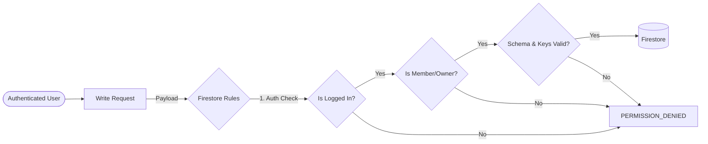
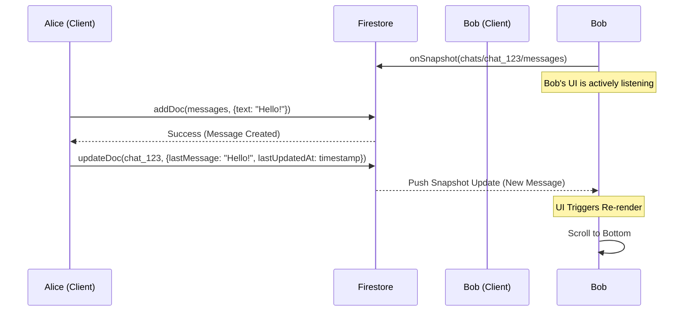
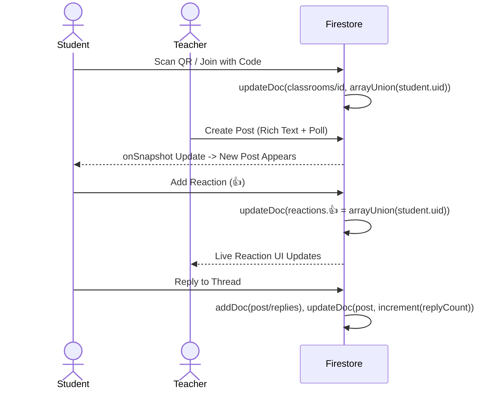

# Campus Connect & Alert System 🎓🚀

Welcome to the comprehensive documentation for the **Campus Connect & Alert System**. This is a highly scalable, real-time, production-ready web application designed for university and college campuses to facilitate seamless communication, instant broadcast alerts, and collaborative digital classrooms.

---

## 📌 Table of Contents

1. [Project Overview](#1-project-overview)
2. [Core Features](#2-core-features)
3. [Technology Stack](#3-technology-stack)
4. [Architecture Visualizations](#4-architecture-visualizations)
    - [High-Level Architecture](#high-level-architecture)
    - [Network & Deployment View](#network--deployment-view)
5. [Database Architecture (Firestore)](#5-database-architecture-firestore)
    - [Collections & Schema](#collections--schema)
    - [Security & Rules](#security--rules)
6. [System Workflows & Sequence Diagrams](#6-system-workflows--sequence-diagrams)
    - [User Authentication Flow](#user-authentication-flow)
    - [Real-time Chatting Flow](#real-time-chatting-flow)
    - [Alert Broadcasting Flow](#alert-broadcasting-flow)
    - [Classroom Post & Reply Flow](#classroom-post--reply-flow)
7. [Frontend Architecture & Component Tree](#7-frontend-architecture--component-tree)
8. [Setup & Installation](#8-setup--installation)
9. [Design Philosophy & UI/UX](#9-design-philosophy--uiux)
10. [Future Enhancements](#10-future-enhancements)

---

## 1. Project Overview

Campus Connect is a real-time web application acting as a central hub for student and faculty interaction. It replaces fragmented WhatsApp groups, email blasts, and outdated university portal boards with a localized, fast, modern alternative. 

The application operates fundamentally on real-time asynchronous data streams via **Firebase**, utilizing **React** for a highly responsive, app-like frontend interface wrapped in **Vite** for rapid tooling and compilation.

---

## 2. Core Features

### 🚨 Real-time Campus Alerts
- **Broadcast System:** Post campus-wide alerts (emergencies, events, lost & found).
- **Instant Notifications:** Users receive real-time pop-up notifications using `framer-motion` and native browser Notifications API.
- **Categorization:** Alerts are categorized for easy filtering (Emergency, Event, Notice, Lost & Found, Questions).
- **Engagement:** Upvoting system and nested reply threads for alerts.

### 📚 Digital Classrooms / Spaces
- **QR Code & Invite Links:** Join classrooms seamlessly using short 6-character codes or by scanning a generated QR code.
- **Multi-Media Posts:** Teachers and students can post rich text (Markdown supported), polls, and attachments.
- **Threaded Discussions:** Every post has its own isolated nested reply thread to prevent chat clutter.
- **Live Polling:** Real-time voting mechanics integrated seamlessly into posts.
- **Reactions:** Emoji-based reaction system for instant feedback on posts.

### 💬 Direct Messaging & Inbox
- **1-on-1 Chat:** Connect directly with peers or instructors.
- **Real-time Synchronization:** Built on Firestore `onSnapshot` listeners, resulting in sub-millisecond message delivery times.
- **Typing Indicators & Read Receipts:** (Extensible architecture laid out).
- **Badging System:** Intelligent unread message detection based on last visited timestamps.

### ⚙️ User Settings & Personalization
- **Profile Customization:** Change display names, avatars, and visibility preferences.
- **Push Notifications Control:** Granular control over FCM (Firebase Cloud Messaging) tokens and local browser permission requests.

---

## 3. Technology Stack

### Frontend Client
- **Core:** React 18
- **Build Tool:** Vite
- **Language:** TypeScript (Strict typing for robust logic)
- **Routing:** React Router v6
- **Styling:** Tailwind CSS (Mobile-first, utility-based CSS)
- **Animations:** Motion (Framer Motion) for fluid layout transitions and micro-interactions.
- **Icons:** Lucide React
- **Typography:** Inter (Sans), JetBrains Mono (Technical/Monospaced)

### Backend & Cloud Infrastructure (Firebase Enterprise)
- **Database:** Cloud Firestore (NoSQL, Real-time document store)
- **Authentication:** Firebase Auth (Google OAuth Provider)
- **Hosting/Deployment:** Google Cloud Run (via Vercel/AI Studio architecture)

---

## 4. Architecture Visualizations

### High-Level Architecture

The system follows a Serverless, Client-Heavy architecture where the React application communicates directly with the Firebase Cloud infrastructure across secured gRPC/WebSockets.

```mermaid
graph TD
    subgraph Client Application [React SPA (Vite)]
        UI[UI Components / Pages]
        State[React Context / Hooks]
        Router[React Router]
        Listener[onSnapshot Listeners]
        
        Router --> UI
        State --> UI
        Listener --> State
    end

    subgraph Firebase Cloud Infrastructure
        Auth[Firebase Authentication]
        Firestore[(Cloud Firestore)]
        Rules{Firestore Security Rules}
    end

    UI -- Login Request --> Auth
    Auth -- JWT Token --> State
    UI -- Write/Query --> Rules
    Rules -- Validate --> Firestore
    Firestore -- Real-time Updates --> Listener
```

### Network & Deployment View


---

## 5. Database Architecture (Firestore)

Firestore is structured securely following **Attribute-Based Access Control (ABAC)** and **Zero-Trust Rules**.

### Collections & Schema

#### `users`
Stores user profile information.
- `uid` (String): Primary Key
- `email` (String)
- `displayName` (String)
- `photoURL` (String)
- `fcmToken` (String | null)
- `showActivity` (Boolean)
- `publicProfile` (Boolean)

#### `alerts`
Stores global campus broadcasts.
- `title` (String)
- `body` (String)
- `category` (String)
- `postedBy` (String - ref to User UID)
- `postedByName` (String)
- `timestamp` (Timestamp)
- `replyCount` (Number)
- `upvoteCount` (Number)

*Subcollections:*
- `alerts/{alertId}/replies`: Comments on the alert.
- `alerts/{alertId}/upvotes`: Tracking who upvoted to prevent double voting.

#### `classrooms`
Stores spaces/groups.
- `code` (String): 6 character join code
- `name` (String)
- `type` (String)
- `ownerId` (String)
- `members` (Array of Strings): UIDs of joined users.

*Subcollections:*
- `classrooms/{classroomId}/posts`: The main feed of the classroom.
- `classrooms/{classroomId}/posts/{postId}/replies`: Threaded comments on a specific post.

#### `chats`
Stores metadata for a 1-on-1 or group conversation.
- `participants` (Array of Strings): UIDs of users in chat.
- `participantNames` (Map/Object)
- `lastMessage` (String)
- `lastUpdatedAt` (Timestamp)
- `lastMsgSenderId` (String)

*Subcollections:*
- `chats/{chatId}/messages`: Individual text payloads.

### Security & Rules

The Firestore Rules (`firestore.rules`) enforce strict validation. We use advanced "Anti-Update-Gap" patterns heavily inspired by robust RBAC/ABAC rules.

**Key Concepts Enforced:**
1. **Schema Validation:** Updates must only contain specifically allowed keys via `affectedKeys().hasOnly()`.
2. **Relational Sync:** You cannot read `messages` unless your UID is in the parent `chat.participants` array. 
3. **Data Integrity:** Timestamps must be `request.time` (Server Time), denying client-spoofed times.



---

## 6. System Workflows & Sequence Diagrams

### Real-time Chatting Flow



### Classroom Post & Reply Flow



---

## 7. Frontend Architecture & Component Tree

The React application is modularized to ensure maximum reusability and clean separation of concerns.

```text
src/
├── App.tsx                 # Root layout, Auth routing, Global Alert Listeners
├── main.tsx                # Vite Mount Point
├── firebase.ts             # Firebase Initialization & Config
├── contexts/
│   └── AuthContext.tsx     # Provides User, Profile, Auth Loading State
├── layouts/
│   └── MainLayout.tsx      # Persistent Sidebar, Bottom Nav, and Background gradients
├── screens/
│   ├── Splash.tsx          # Initial loading / Auth Wall
│   ├── Board.tsx           # Global Campus Alerts Feed
│   ├── Classrooms.tsx      # List of Joined Spaces
│   ├── ClassroomDetail.tsx # Deep dive into a specific Space
│   ├── Inbox.tsx           # List of active Chat Rooms
│   ├── ChatScreen.tsx      # 1-on-1 interface
│   ├── Settings.tsx        # Preference mutations
│   └── Search.tsx          # Global User directory
├── components/
│   ├── AlertCard.tsx       # Reusable Alert UI
│   └── shared/             # (Buttons, Inputs, Modals)
└── constants/
    └── categories.ts       # Enums and Configs
```

### Global Notification Engine

`App.tsx` acts as more than just a router. It mounts two persistent `onSnapshot` listeners that survive tab unmounting (as long as the app is open):
1. **Global Alerts Listener:** Listens to the `/alerts` collection. If a new document is added by someone else, it triggers a custom Framer Motion pop-up toast and plays a sound (`/notification.mp3`).
2. **Chat Inbox Listener:** Monitors `/chats` where `participants` contains the user. Triggers an unread badge on the Navigation bar and a Toast notification if the user isn't physically inside that specific chat route.

---

## 8. Setup & Installation

To run this project locally or fork it for your own campus:

### Prerequisites
- Node.js v18+
- npm or yarn or pnpm
- A Firebase Project (with Firestore and Authentication [Google Provider] enabled)

### Steps

1. **Clone & Install**
   ```bash
   git clone <repository_url>
   cd campus-connect
   npm install
   ```

2. **Environment Variables**
   Create a `.env` file (if dynamically configuring) or ensure `firebase-applet-config.json` points to your active Firebase project.
   
3. **Run Development Server**
   ```bash
   npm run dev
   ```
   *The application will spin up usually on `http://localhost:3000` or `http://localhost:5173`.*

4. **Deploy Rules**
   Ensure your firestore rules are migrated to your Firebase Console:
   ```bash
   firebase deploy --only firestore:rules
   ```

5. **Build for Production**
   ```bash
   npm run build
   ```

---

## 9. Design Philosophy & UI/UX

Campus Connect distances itself from rigid, corporate academic portals. 
- **Dark Mode Native:** Deep purple and cyan gradients (`var(--color-brand-bg-primary)`) create a modern, "night-owl" developer aesthetic.
- **Micro-Interactions:** The usage of `framer-motion` adds bounce effects to buttons, smooth height transitions to expanding threads, and sliding toasts to soften abrupt state changes.
- **Information Density:** Modals and lists use dense padding and Apple-like blur filters (`backdrop-blur-md`) to layer context over content without losing screen real estate.
- **Mobile First:** The bottom navigation bar on mobile devices replaces the sidebar, ensuring one-handed thumb usability. Text inputs in Chat and Classrooms inherently account for Mobile Safari Safe Area insets (`env(safe-area-inset-bottom)`).

---

## 10. Future Enhancements

The architecture is built to support massive horizontal scaling. Future roadmap features could include:
1. **Push Notifications (FCM):** Integrating Service Workers for background notifications when the browser tab is closed.
2. **Algorithmic Board:** Sorting the Alert Board by velocity (Upvotes per hour) rather than pure chronological order.
3. **File Attachments in Chat:** Integrating Firebase Cloud Storage to allow PDF and Image transfers in direct messages.
4. **Presence System:** Tracking real-time "Online" or "Typing..." states using Firebase Realtime Database (better suited for ephemeral presence than Firestore's document writes).

---

*Documentation auto-generated and structured for maximum developer velocity. 🚀🎓*
