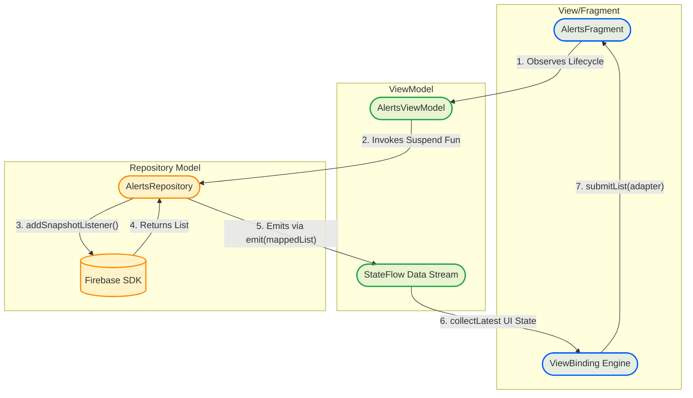
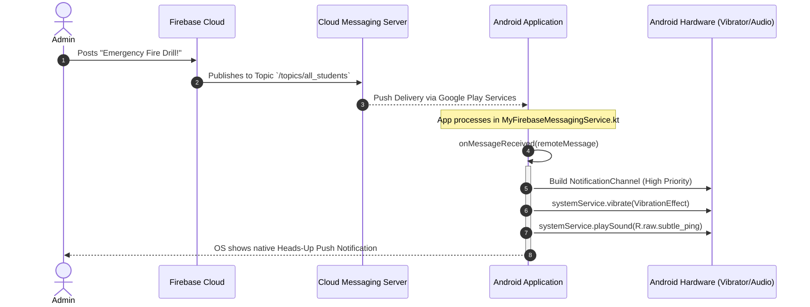
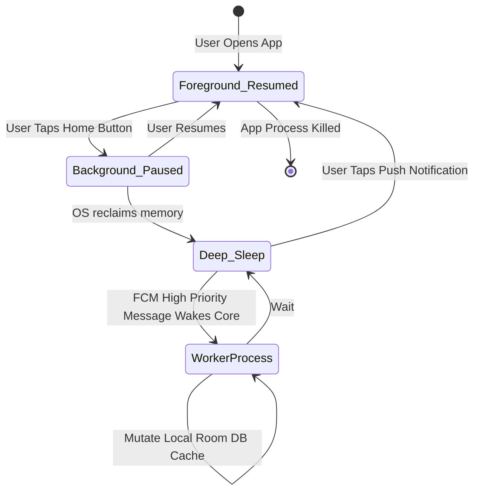

<div align="center">
  
  <h1>Campus Connect <strong>Android Architecture</strong></h1>
  <p>Native Android Implementation Guide & Architecture Documentation</p>

  <p>
    
    
    
  </p>
</div>

This document outlines the **Native Android (Kotlin & XML)** architectural blueprint for Campus Connect. While the primary distribution is a Progressive Web App (PWA), this guide dictates exactly how a native port scales utilizing modern Android Studio paradigms like MVVM, Coroutines, and ViewBinding.

---

## 1. Native Application Architecture (MVVM)

The Android implementation strictly adheres to the Model-View-ViewModel (MVVM) architectural pattern to decouple UI presentation from Firestore Firebase networking data logic.

### Android Structural Components

| Layer | Responsibility | Android Paradigm Used |
|---|---|---|
| **View** | Renders UI & intercepts specific inputs | `Fragment`, `Activity`, `XML Layouts` |
| **ViewModel** | Preserving state across configuration changes | `Architecture Components ViewModel` |
| **Model/Repository** | Single Source of Truth for Data | `Kotlin Flow`, `FirebaseFirestore` |

---

## 2. Kotlin Class Design & Code Architecture

### 2.1 The Repository (Firestore Real-time Observation)
Real-time snapshot listeners map perfectly to **Kotlin StateFlow & CallbackFlow**.

```kotlin
class ChatRepository(private val db: FirebaseFirestore) {

    // Converts Firebase onSnapshot into a reactive Kotlin Flow
    @ExperimentalCoroutinesApi
    fun getMessages(chatId: String): Flow<List<Message>> = callbackFlow {
        val subscription = db.collection("chats")
            .document(chatId)
            .collection("messages")
            .orderBy("timestamp", Query.Direction.ASCENDING)
            .addSnapshotListener { snapshot, error ->
                if (error != null) {
                    cancel("Error fetching messages", error)
                    return@addSnapshotListener
                }
                val messages = snapshot?.toObjects(Message::class.java) ?: emptyList()
                trySend(messages).isSuccess
            }
        
        // Unregister listener when coroutine scope is cancelled
        awaitClose { subscription.remove() }
    }
}
```

### 2.2 The ViewModel (Data Orchestration)
The ViewModel bridges the Repository to the UI using Lifecycle-aware coroutines.

```kotlin
@HiltViewModel
class ChatViewModel @Inject constructor(
    private val repository: ChatRepository,
    savedStateHandle: SavedStateHandle
) : ViewModel() {

    private val chatId: String = savedStateHandle["chatId"] ?: ""
    
    private val _messages = MutableStateFlow<List<Message>>(emptyList())
    val messages: StateFlow<List<Message>> = _messages.asStateFlow()

    init {
        // Collect real-time changes
        viewModelScope.launch {
            repository.getMessages(chatId).collect { msgList ->
                _messages.value = msgList
            }
        }
    }
}
```

---

## 3. UI Design via XML Layouts

While Jetpack Compose is newer, standard **XML Layouts** with ViewBinding are highly reliable for complex chat recycler views. 

### 3.1 Chat Fragment Layout (`fragment_chat.xml`)
We utilize `ConstraintLayout` to flexibly manage the chat input field, send button, and the RecyclerView list.

```xml
<?xml version="1.0" encoding="utf-8"?>
<androidx.constraintlayout.widget.ConstraintLayout
    xmlns:android="http://schemas.android.com/apk/res/android"
    xmlns:app="http://schemas.android.com/apk/res-auto"
    android:layout_width="match_parent"
    android:layout_height="match_parent"
    android:background="@color/brand_bg_primary">

    <androidx.recyclerview.widget.RecyclerView
        android:id="@+id/recyclerViewMessages"
        android:layout_width="0dp"
        android:layout_height="0dp"
        app:layout_constraintTop_toTopOf="parent"
        app:layout_constraintBottom_toTopOf="@id/inputContainer"
        app:layout_constraintStart_toStartOf="parent"
        app:layout_constraintEnd_toEndOf="parent" 
        android:clipToPadding="false"
        android:paddingBottom="12dp" />

    <LinearLayout
        android:id="@+id/inputContainer"
        android:layout_width="match_parent"
        android:layout_height="wrap_content"
        android:orientation="horizontal"
        android:padding="8dp"
        android:background="#12121A"
        app:layout_constraintBottom_toBottomOf="parent">

        <EditText
            android:id="@+id/messageInput"
            android:layout_width="0dp"
            android:layout_weight="1"
            android:layout_height="48dp"
            android:background="@drawable/rounded_input_bg"
            android:hint="Chat Message..."
            android:textColor="#FFFFFF"
            android:textColorHint="#888888"
            android:paddingHorizontal="16dp"/>

        <ImageButton
            android:id="@+id/sendButton"
            android:layout_width="48dp"
            android:layout_height="48dp"
            android:background="?selectableItemBackgroundBorderless"
            android:src="@drawable/ic_send"
            app:tint="@color/brand_accent_purple" />
    </LinearLayout>
</androidx.constraintlayout.widget.ConstraintLayout>
```

---

## 4. Control Flow & Diagrams

### 4.1 MVVM Component Control Flow Diagram

This diagram charts the internal architecture logic within the Android application when a user views their class alerts.



### 4.2 Sequence Flow: Native Notification Haptics & FCM Delivery

When building natively, Firebase Cloud Messaging (FCM) is handled by inheriting `FirebaseMessagingService`. This allows us to trigger physical device sensors directly (like the Web API `navigator.vibrate` does, but native).



### 4.3 App Lifecycle & Background Sync Flow

Unlike the Web API, Android apps go into Deep Sleep. The `WorkManager` API handles synchronizing the `users` read-receipt badges even if the app is destroyed.



---

## 5. Device Sensor Integrations (Native Advantages)

Moving to a Native Android architecture yields several profound benefits over web wrappers:

1. **Precision Haptics**: Bypassing the arbitrary web `navigator.vibrate` for `VibratorManager` offering distinct primitives (`VibrationEffect.createPredefined(EFFECT_CLICK)`).
2. **Foreground Services**: Ensuring the application keeps listening to critical classroom WebRTC connections by declaring an active foreground service payload overriding Doze mode.
3. **Room Caching**: While Firestore provides native offline persistence, writing a middle-layer `Room` SQL interceptor ensures list scrolling stays locked at 120hz (Jetpack Compose/RecyclerView) by skipping the JSON parsing latency inherent to Firestore payload decodes on the main thread.
