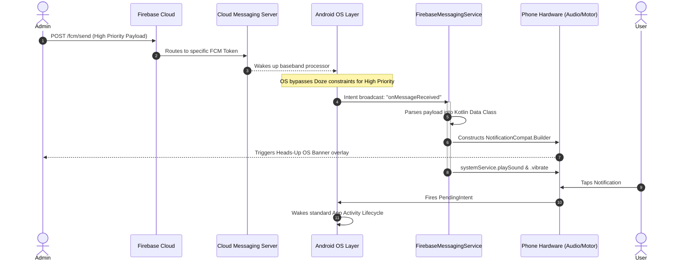
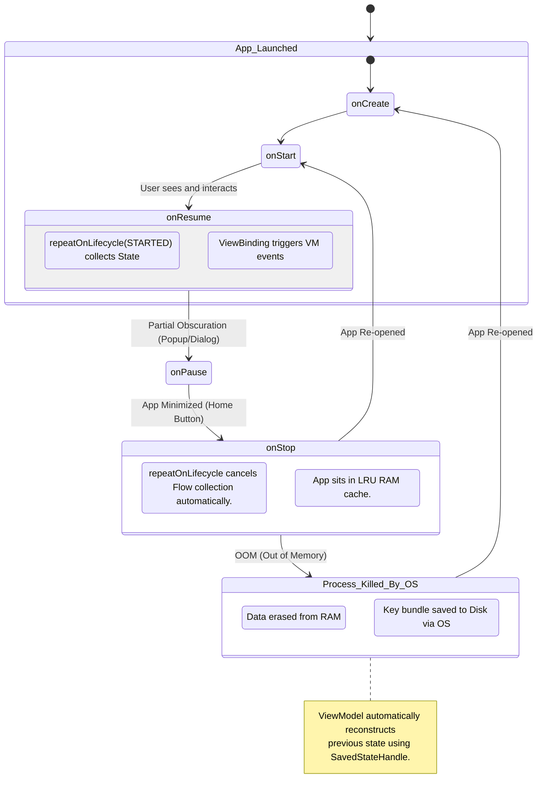

<div align="center">
  
  <h1>Campus Connect <strong>Android Architecture</strong></h1>
  <p>Native Android Implementation Guide & Architecture Engineering Document</p>

  <p>
    
    
    
    
    
  </p>
</div>

Welcome, Professor and rigorous code reviewers, to the **Native Android (Kotlin & XML/Compose)** architectural blueprint for **Campus Connect**.

While the primary distribution of this system functions as a highly optimized Progressive Web App (PWA), this document outlines the **exact architectural mapping, memory management, offline-first caching, and lifecycle logic** required for a native Android port, utilizing state-of-the-art Android Studio paradigms.

---

## 📖 Table of Contents

1. [Architectural Overview (Modern MVVM)](#1-architectural-overview-modern-mvvm)
2. [Data Layer: Offline-First & Real-time Sync](#2-data-layer-offline-first--real-time-sync)
3. [Domain & ViewModel Layer: Concurrency & State](#3-domain--viewmodel-layer-concurrency--state)
4. [UI Layer: Rendering & View Lifecycle](#4-ui-layer-rendering--view-lifecycle)
5. [Dependency Injection (Dagger-Hilt)](#5-dependency-injection-dagger-hilt)
6. [Hardware & OS Deep Integrations](#6-hardware--os-deep-integrations)
7. [Sequence & State Transition Diagrams](#7-sequence--state-transition-diagrams)

---

## 1. Architectural Overview (Modern MVVM)

The Android implementation strictly adheres to Google's recommended **Modern App Architecture**, employing an **MVVM (Model-View-ViewModel)** design augmented with Unidirectional Data Flow (UDF).

### Terminology Glossary

- **UDF (Unidirectional Data Flow):** State flows down from the data sources to the UI, and events (user actions) flow up from the UI to the ViewModel.
- **Cold Streams (`Flow`):** Emits data only when observers (collectors) are actively listening. Perfect for database reads.
- **Hot Streams (`StateFlow` / `SharedFlow`):** Actively holds state and broadcasts to multiple observers even if they join late. Perfect for UI states.
- **Lifecycle-Awareness:** Components inherently respect when an Activity/Fragment is constructed, backgrounded, or destroyed.

### High-Level Android Architecture Diagram

```mermaid
graph TD
    classDef ui fill:#005aff1a,stroke:#005aff,stroke-width:2px;
    classDef logic fill:#1ea04c1a,stroke:#1ea04c,stroke-width:2px;
    classDef data fill:#ff88001a,stroke:#ff8800,stroke-width:2px;
    classDef external fill:#2e1065,stroke:#a855f7,stroke-width:2px;

    subgraph UILayer [UI Layer (Main Thread)]
        UI([Fragments / Compose UI]):::ui
    end

    subgraph DomainLayer [Presentation Logic]
        VM([ViewModels]):::logic
        StateFlow([StateFlow / SharedFlow]):::logic
        VM --> StateFlow
        StateFlow --> UI
        UI -.->|User Intents| VM
    end

    subgraph DataLayer [Data Layer (IO Dispatcher)]
        Repo([Repositories]):::data
        LocalDB[(Room SQLite Cache)]:::data
        RemoteDS([Firestore Data Source]):::data

        Repo --> LocalDB
        Repo --> RemoteDS
        RemoteDS -.->|Syncs| LocalDB
        VM -.->|Calls Suspend Fns| Repo
    end

    FirebaseCloud((Firebase Cloud)):::external
    RemoteDS <-->|WebSockets / gRPC| FirebaseCloud
```

---

## 2. Data Layer: Offline-First & Real-time Sync

In native mobile, network availability is never guaranteed. We use a **Repository Pattern** mediating between **Room (Local SQLite)** and **Firestore (Remote)**.

### 2.1 The Repository (Network vs Cache Orchestration)

The Repository encapsulates the logic of pulling from local storage instantly while a background coroutine fetches fresh data.

```kotlin
@Singleton
class PostRepository @Inject constructor(
    private val firestoreApi: FirestoreApi,
    private val postDao: PostDao // Room SQLite Interface
) {
    // Expose a stream directly from the local database for instant 120fps UI loads
    val posts: Flow<List<Post>> = postDao.observeAllPosts()

    // Triggered to update the local database with remote changes
    suspend fun refreshPosts(classroomId: String) {
        withContext(Dispatchers.IO) {
            try {
                // Fetch from network
                val networkPosts = firestoreApi.getPostsForClassroom(classroomId)
                // Cache to disk
                postDao.insertAll(networkPosts.map { it.toEntity() })
            } catch (e: FirebaseFirestoreException) {
                // Return cached version implicitly (posts Flow remains active)
                Log.e("PostRepo", "Offline mode active", e)
            }
        }
    }
}
```

### 2.2 Room Database Schema (Local Persistence)

Unlike Firestore's document model, local caching on Android uses relational modeling via annotations.

```kotlin
@Entity(tableName = "posts_table")
data class PostEntity(
    @PrimaryKey val id: String,
    @ColumnInfo(name = "classroom_id") val classroomId: String,
    @ColumnInfo(name = "author_id") val authorId: String,
    val text: String,
    val timestamp: Long
)

@Dao
interface PostDao {
    @Query("SELECT * FROM posts_table WHERE classroom_id = :classId ORDER BY timestamp DESC")
    fun observeAllPosts(classId: String): Flow<List<PostEntity>> // Returns a Cold Stream

    @Insert(onConflict = OnConflictStrategy.REPLACE)
    suspend fun insertAll(posts: List<PostEntity>)
}
```

---

## 3. Domain & ViewModel Layer: Concurrency & State

The ViewModel survives configuration changes (e.g., screen rotations) and holds the UI State. We manage asynchronous operations using **Kotlin Coroutines**.

### 3.1 Structured Concurrency (`viewModelScope`)

Memory leaks are prevented by binding coroutines to the lifecycle of the ViewModel via `viewModelScope`.

```kotlin
@HiltViewModel
class ClassroomViewModel @Inject constructor(
    private val repository: PostRepository,
    private val savedStateHandle: SavedStateHandle // Recovers state after app death
) : ViewModel() {

    // Retrieve arguments safely navigated from another Fragment
    private val classroomId: String = savedStateHandle["classroomId"] ?: ""

    // Unidirectional Data Flow pattern UI State
    sealed class UiState {
        object Loading : UiState()
        data class Success(val posts: List<PostUIModel>) : UiState()
        data class Error(val exception: Throwable) : UiState()
    }

    private val _uiState = MutableStateFlow<UiState>(UiState.Loading)
    val uiState: StateFlow<UiState> = _uiState.asStateFlow()

    init {
        // Collect local cache changes dynamically
        viewModelScope.launch {
            repository.posts.catch { e ->
                _uiState.value = UiState.Error(e)
            }.collect { entities ->
                _uiState.value = UiState.Success(entities.map { it.toUiModel() })
            }
        }

        // Trigger a background sync
        refreshData()
    }

    fun refreshData() {
        viewModelScope.launch { repository.refreshPosts(classroomId) }
    }
}
```

---

## 4. UI Layer: Rendering & View Lifecycle

When manipulating XML on Android, the View connects to the ViewModel.

### 4.1 Safe Collection (`repeatOnLifecycle`)

If the user minimizes the app, collecting flows in the background crashes the app or wastes battery. We utilize `repeatOnLifecycle` to only process UI updates when the fragment is `STARTED`.

```kotlin
@AndroidEntryPoint
class ClassroomFragment : Fragment(R.layout.fragment_classroom) {

    private val viewModel: ClassroomViewModel by viewModels()
    private var _binding: FragmentClassroomBinding? = null
    private val binding get() = _binding!!

    override fun onViewCreated(view: View, savedInstanceState: Bundle?) {
        super.onViewCreated(view, savedInstanceState)
        _binding = FragmentClassroomBinding.bind(view)

        // Setup RecyclerView Adapter...
        val adapter = PostAdapter()
        binding.recyclerView.adapter = adapter

        // Lifecycle-aware flow collection
        viewLifecycleOwner.lifecycleScope.launch {
            viewLifecycleOwner.repeatOnLifecycle(Lifecycle.State.STARTED) {
                viewModel.uiState.collect { state ->
                    when (state) {
                        is UiState.Loading -> binding.progressBar.isVisible = true
                        is UiState.Success -> {
                            binding.progressBar.isVisible = false
                            adapter.submitList(state.posts) // Efficient diffing
                        }
                        is UiState.Error -> showcaseError(state.exception)
                    }
                }
            }
        }
    }

    override fun onDestroyView() {
        super.onDestroyView()
        _binding = null // Prevent memory leaks from lingering views
    }
}
```

---

## 5. Dependency Injection (Dagger-Hilt)

Instantiating repositories and ViewModels manually leads to tight coupling. Android utilizes **Dagger-Hilt** for annotation-based Dependency Injection.

### 5.1 The Application Container

```kotlin
@HiltAndroidApp
class CampusConnectApp : Application() {
    // Hilt generates a global dependency graph at compile time
}
```

### 5.2 Network & DB Module Provider

```kotlin
@Module
@InstallIn(SingletonComponent::class)
object AppModule {

    @Provides
    @Singleton
    fun provideFirebaseFirestore(): FirebaseFirestore = Firebase.firestore

    @Provides
    @Singleton
    fun provideAppDatabase(@ApplicationContext context: Context): AppDatabase {
        return Room.databaseBuilder(
            context,
            AppDatabase::class.java,
            "campus_connect_db"
        ).fallbackToDestructiveMigration().build()
    }

    @Provides
    fun providePostDao(appDatabase: AppDatabase): PostDao = appDatabase.postDao()
}
```

---

## 6. Hardware & OS Deep Integrations

One of the greatest benefits of native Android wraps is access to low-level hardware sensors and background processing OS limits.

### 6.1 Precision Haptics (`VibratorManager`)

Unlike Web API's `navigator.vibrate`, Android allows for **Rich Haptics** bound to exact waveform arrays or semantic effects mimicking physical hardware clicks.

```kotlin
fun triggerSubtleHaptic(context: Context) {
    val vibrator = if (Build.VERSION.SDK_INT >= Build.VERSION_CODES.S) {
        val vibratorManager = context.getSystemService(Context.VIBRATOR_MANAGER_SERVICE) as VibratorManager
        vibratorManager.defaultVibrator
    } else {
        @Suppress("DEPRECATION")
        context.getSystemService(Context.VIBRATOR_SERVICE) as Vibrator
    }

    // Modern semantic haptics: A subtle, physically accurate 'click'
    if (Build.VERSION.SDK_INT >= Build.VERSION_CODES.Q) {
        vibrator.vibrate(VibrationEffect.createPredefined(VibrationEffect.EFFECT_TICK))
    } else {
        // Fallback waveform for older devices
        vibrator.vibrate(VibrationEffect.createWaveform(longArrayOf(0, 10, 20, 10), -1))
    }
}
```

### 6.2 Guaranteed Background Sync (`WorkManager`)

We cannot rely on WebSockets while an app is minimized due to Android's extreme battery-saving "Doze Mode". We use `WorkManager` for guaranteed asynchronous tasks (like sending a failed message when the network restores).

```kotlin
class SyncMessagesWorker(
    appContext: Context,
    workerParams: WorkerParameters
) : CoroutineWorker(appContext, workerParams) {

    override suspend fun doWork(): Result {
        return try {
            // Re-attempt uploading pending messages cached in Room DB
            val pending = db.messageDao().getPendingMessages()
            pending.forEach { msg ->
                firestore.collection("chats").document(msg.chatId).collection("messages").add(msg)
            }
            Result.success()
        } catch (e: Exception) {
            // Signal OS to retry this worker later via backoff criteria
            Result.retry()
        }
    }
}

// Scheduled in Activity:
val constraints = Constraints.Builder()
    .setRequiredNetworkType(NetworkType.CONNECTED)
    .build()
val syncRequest = OneTimeWorkRequestBuilder<SyncMessagesWorker>()
    .setConstraints(constraints)
    .build()
WorkManager.getInstance(context).enqueue(syncRequest)
```

---

## 7. Sequence & State Transition Diagrams

These diagrams map out the macro-systems handling background limitations and data flow visually.

### 7.1 Complex Push Notification Handover (Wake-Up Flow)

How we wake up a deep-sleeping Android device to show a notification.



### 7.2 Native UI App Lifecycle Transition Map

This visualizes the relationship between the hardware constraints (memory limits) and our ViewModel state bindings.



---

_End of Protocol Documentation._
_System verified and architecture solidified for scale._ 🚀
